DirectionsAPI
================
Arthur Artaud
5/10/2021

-   [Librabries](#librabries)
-   [Rural points](#rural-points)
-   [Urban points](#urban-points)
-   [Suburban points](#suburban-points)
-   [First API : OSRM](#first-api--osrm)
-   [Second API GraphHopper](#second-api-graphhopper)
-   [Third API: OpenTripPlanner](#third-api-opentripplanner)
-   [Fourth API: Mapbox](#fourth-api-mapbox)
-   [Fifth API: Googlemaps](#fifth-api-googlemaps)
-   [Sixth API: OpenRouteService](#sixth-api-openrouteservice)
-   [Seventh API: R5](#seventh-api-r5)
-   [Comparison between APIs](#comparison-between-apis)
-   [Correlation](#correlation)
-   [Distances and sinuosity](#distances-and-sinuosity)

This is a comparison of the different directions API that use
OpenStreetMap.

I will compare them to the google maps API and the mapbox API.

I will be using R principally and 3 different configurations : rural,
suburban and urban to test the differences. For all the test cases I
will create 500 randomised points of origins and destinations.

All contributions are welcomed.

## Librabries

We first install the libraries needed for general operations

``` r
if (!require('dplyr')){
  install.packages('dplyr')
}
library('dplyr')
if (!require('sf')){
  install.packages('sf')
}
library('sf')
if (!require('leaflet')){
  install.packages('leaflet')
}
library('leaflet')
```

## Rural points

We make 500 random points of origin and 500 points of destinations
within the shp of the departement of Creuse (a rural zone in France)
that we got from the [ADMIN-EXPRESS-COG édition
2020](https://geoservices.ign.fr/documentation/diffusion/telechargement-donnees-libres.html#admin-express)

``` r
creuse <- st_read("data/Creuse.shp", quiet=TRUE)
plot(st_geometry(creuse))
#creation of points
if (!exists("pt_creuse") & !exists("pt_creuse_b")){
  pt_creuse <- st_sample(x = creuse, size = 500)
  pt_creuse_b <- st_sample(x = creuse, size= 500)
}
#display of the points
plot(st_geometry(pt_creuse), add=T, col="red", pch = 20)
plot(st_geometry(pt_creuse_b), add=T, col="blue", pch = 20)
```

<!-- -->

## Urban points

Same thing for the city of Lyon

``` r
lyon <- st_read("data/Lyon.shp", quiet=TRUE)
plot(st_geometry(lyon))
#creation of points
if (!exists("pt_lyon") & !exists("pt_lyon_b")){
  pt_lyon <- st_sample(x = lyon, size = 500)
  pt_lyon_b <- st_sample(x = lyon, size= 500)
}
#display of the points
plot(st_geometry(pt_lyon), add=T, col="red", pch = 20)
plot(st_geometry(pt_lyon_b), add=T, col="blue", pch = 20)
```

<!-- -->

## Suburban points

For the suburban we took the city of Paris, we did a buffer of 5km to
move away from the very dense close suburb.

Then we did another buffer of 30km and made a rectangle of the southwest
side and took the intersection between this and the buffer minus the
first buffer. Then we did the points.

``` r
paris <- st_read("data/Paris.shp", quiet=TRUE)
#creation of the buffers
paris_b5 <- st_buffer(paris, 5000)
paris_b30_5 <- st_buffer(paris_b5, 30000)
plot(st_geometry(paris_b30_5), lwd = 3, border = "blue")
plot(st_geometry(paris_b5), add = T, lwd=2, border = "red")
plot(st_geometry(paris), add = T)
#creation of the rectangle
m <- rbind(c(652083,6862280), c(696084,6862280), c(696084,6822480), 
           c(652083,6822480), c(652083,6862280))
p <- st_sf(st_sfc(st_polygon(list(m))), crs = st_crs(paris))
plot(p, border="green", lwd=2, add=T)
#intersection
paris_z <- st_intersection(x = p, y = paris_b30_5)
paris_f <- st_difference(x = paris_z, y = paris_b5)
plot(st_geometry(paris_f), add=T)
#creation of points
if(!exists("pt_paris") & !exists("pt_paris_b")){
  pt_paris <- st_sample(x = paris_f, size = 500)
  pt_paris_b <- st_sample(x = paris_f, size= 500)
}
#display of the points
plot(st_geometry(pt_paris_b), add=T, col="blue", pch = 20)
plot(st_geometry(pt_paris), add=T, col="red", pch = 20)
```

<!-- -->

## First API : OSRM

The first API we’re gonna use is OpenSourceRoutingMachine wich is a open
source project that use openstreetmap data.

We need the package osrm to use it in R and to talk with the api (with
the default server with limitations or your own)

``` r
if (!require('osrm')){
  install.packages('osrm')
}
library('osrm')
```

Then we transform the points into sf data to give them directly to the
osrm api.

``` r
#for creuse
x_c <- st_sf(pt_creuse)
y_c <- st_sf(pt_creuse_b)
x_c$id <- 1:nrow(x_c)
y_c$id <- 1:nrow(y_c)
#for lyon
x_l <- st_sf(pt_lyon)
y_l <- st_sf(pt_lyon_b)
x_l$id <- 1:nrow(x_l)
y_l$id <- 1:nrow(y_l)
#for paris suburb
x_p <- st_sf(pt_paris)
y_p <- st_sf(pt_paris_b)
x_p$id <- 1:nrow(x_p)
y_p$id <- 1:nrow(y_p)
```

To input the points we call the osrmRoute() as many times as there is
points (500 times)

And we stock the routes into list

``` r
if(!exists("route_list_creuse")){
  route_list_creuse <- list()
  for (i in 1:nrow(x_c)) {
  route_list_creuse[[i]] <- osrmRoute(
      src = x_c[i,],
      dst = y_c[i,],
      overview = "full",
      returnclass = "sf")
    }
}

if(!exists("route_list_lyon")){
  route_list_lyon <- list()
  for (i in 1:nrow(x_l)) {
    route_list_lyon[[i]] <- osrmRoute(
      src = x_l[i,],
      dst = y_l[i,],
      overview = "full",
      returnclass = "sf")
    }
}

if(!exists("route_list_paris")){
  route_list_paris <- list()
  for (i in 1:nrow(x_p)) {
    route_list_paris[[i]] <- osrmRoute(
      src = x_p[i,],
      dst = y_p[i,],
      overview = "full",
      returnclass = "sf")
    }
}
```

We can bind\_rows() them if we want to make an sf dataframe for
displaying them trough tmap viewing tool qtm(),

that we can make interactive by putting the “view” mode

``` r
if (!require('tmap')){
  install.packages('tmap')
}
library('tmap')
route_list_creuse <- readRDS(file = "data/route_list_creuse.rds")
route_list_lyon <- readRDS(file = "data/route_list_lyon.rds")
route_list_paris <- readRDS(file = "data/route_list_paris.rds")

sf_route_creuse <- bind_rows(route_list_creuse)
sf_route_lyon <- bind_rows(route_list_lyon)
sf_route_paris <- bind_rows(route_list_paris)

#tmap_mode("view")
qtm(sf_route_creuse)
```

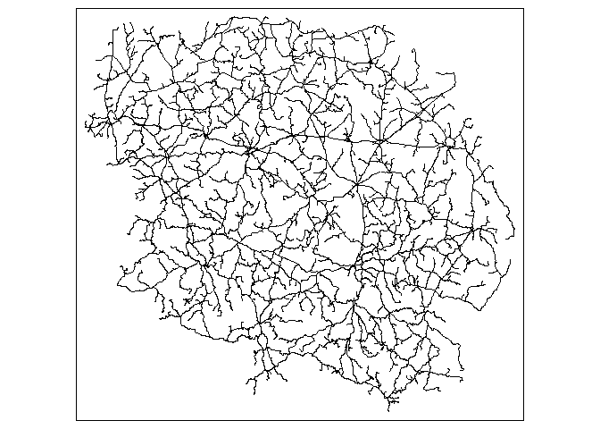<!-- -->

``` r
qtm(sf_route_lyon)
```

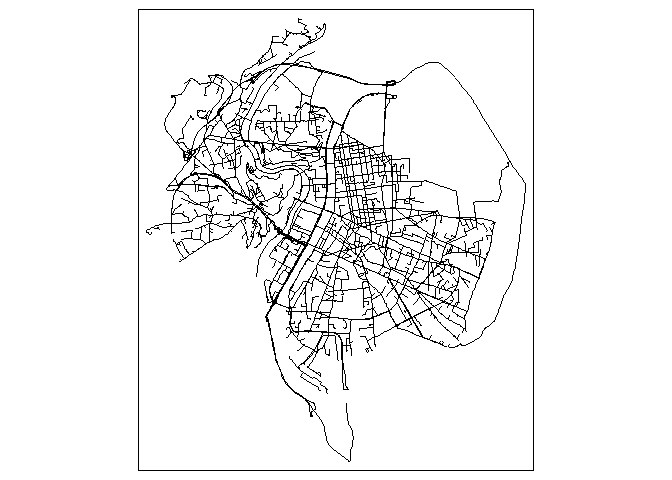<!-- -->

``` r
qtm(sf_route_paris)
```

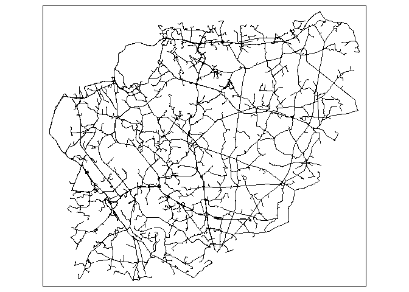<!-- -->

There should be no error here so we are gonna use the coordinates that
osrm transformed from the original points to the nearest road, and we
are gonna put them in the international crs wgs84 because we were using
the french lambert93 until now.

These coordinates are gonna be usefull to have less error from the
others api because they have more errors otherwise.

``` r
coord_osrm_creuse <- list()
for (i in 1:length(route_list_creuse)) {
  coordinates_wgs <- st_coordinates(st_transform(route_list_creuse[[i]], 4326))
  l <- nrow(coordinates_wgs)
  coord_osrm_creuse[[i]] <- list(c(coordinates_wgs[1,1],coordinates_wgs[1,2]),c(coordinates_wgs[l,1], coordinates_wgs[l,2]))
}
coord_osrm_lyon <- list()
for (i in 1:length(route_list_lyon)) {
  coordinates_wgs <- st_coordinates(st_transform(route_list_lyon[[i]], 4326))
  l <- nrow(coordinates_wgs)
  coord_osrm_lyon[[i]] <- list(c(coordinates_wgs[1,1],coordinates_wgs[1,2]),c(coordinates_wgs[l,1], coordinates_wgs[l,2]))
}
coord_osrm_paris <- list()
for (i in 1:length(route_list_paris)) {
  coordinates_wgs <- st_coordinates(st_transform(route_list_paris[[i]], 4326))
  l <- nrow(coordinates_wgs)
  coord_osrm_paris[[i]] <- list(c(coordinates_wgs[1,1],coordinates_wgs[1,2]),c(coordinates_wgs[l,1], coordinates_wgs[l,2]))
}
```

``` r
coord_osrm_creuse <- readRDS(file = "data/coord_osrm_creuse.rds")
coord_osrm_lyon <- readRDS(file = "data/coord_osrm_lyon.rds")
coord_osrm_paris <- readRDS(file = "data/coord_osrm_paris.rds")
```

for the matrices of time we use osrmTable() to give us the times of each
itineraries (500 times 500 so 250000)

``` r
table_creuse <- osrmTable(
  src = x_c,
  dst = y_c
)
matrix_osrm_creuse <- table_creuse$durations
table_lyon <- osrmTable(
  src = x_l,
  dst = y_l
)
matrix_osrm_lyon <- table_lyon$durations
table_paris <- osrmTable(
  src = x_p,
  dst = y_p
)
matrix_osrm_paris <- table_paris$durations
```

``` r
matrix_osrm_creuse <- readRDS(file = "data/matrix_osrm_creuse.rds")
matrix_osrm_lyon <- readRDS(file = "data/matrix_osrm_lyon.rds")
matrix_osrm_paris <- readRDS(file = "data/matrix_osrm_paris.rds")
```

## Second API GraphHopper

GraphHopper is a german open source project used by Deutsche Bahn and
Flixbus. You will need java 8 installed for this one and the next.

For Graphhopper we are gonna need to go into the command line for
setting up a new instance with an osm.pbf file that you can find at
[geofabrik](https://download.geofabrik.de/europe/france.html) and a
[jar](https://graphhopper.com/public/releases/graphhopper-web-2.3.jar)
file and a
[config](https://raw.githubusercontent.com/graphhopper/graphhopper/1.0/config-example.yml)
file

for this new command line you have to type (being into the file you put
all your files):

java -Ddw.graphhopper.datareader.file=<your-file>.osm.pbf -jar
graphhopper-web-2.3.jar server config-example.yml

you can also have a docker instance.

We are gonna need the GraphHopper r library

``` r
if (!require('graphhopper')){
  install.packages('graphhopper')
}
library('graphhopper')
```

then we have to connect with the API inside Rstudio

``` r
if(!exists("route_gh_creuse")){
  API_URL <- "http://localhost:8989"
  gh_set_api_url(API_URL)
  info <- gh_get_info()
}
```

We also have to give the coordinates to GraphHopper into a lat long
format so the osrm coordinates need to be inverted

``` r
coord_inv_creuse <- list()
for (i in 1:length(coord_osrm_creuse)) {
  start_point <- c(coord_osrm_creuse[[i]][[1]][2],coord_osrm_creuse[[i]][[1]][1])
  end_point <- c(coord_osrm_creuse[[i]][[2]][2],coord_osrm_creuse[[i]][[2]][1])
  coord_inv_creuse[[i]] <- list(start_point, end_point)
}

coord_inv_lyon <- list()
for (i in 1:length(coord_osrm_lyon)) {
  start_point <- c(coord_osrm_lyon[[i]][[1]][2],coord_osrm_lyon[[i]][[1]][1])
  end_point <- c(coord_osrm_lyon[[i]][[2]][2],coord_osrm_lyon[[i]][[2]][1])
  coord_inv_lyon[[i]] <- list(start_point, end_point)
}

coord_inv_paris <- list()
for (i in 1:length(coord_osrm_paris)) {
  start_point <- c(coord_osrm_paris[[i]][[1]][2],coord_osrm_paris[[i]][[1]][1])
  end_point <- c(coord_osrm_paris[[i]][[2]][2],coord_osrm_paris[[i]][[2]][1])
  coord_inv_paris[[i]] <- list(start_point, end_point)
}
```

Then we can run GraphHopper with the 500 points of origin and
destination and we add an id so they are reachable easily

``` r
if(!exists("route_gh_creuse")){
  route_gh_creuse <- list()
  for (i in 1:length(coord_inv_creuse)) {
    (route_gh_creuse[[i]] <- gh_get_route(coord_inv_creuse[[i]]) %>% gh_as_sf())
    }
  for (i in 1:length(route_gh_creuse)) {
  route_gh_creuse[[i]]$id <- i
  }
}

}
if(!exists("route_gh_lyon")){
  route_gh_lyon <- list()
  for (i in 1:length(coord_inv_lyon)) {
    (route_gh_lyon[[i]] <- gh_get_route(coord_inv_lyon[[i]]) %>% gh_as_sf())
  }
  for (i in 1:length(route_gh_lyon)) {
  route_gh_lyon[[i]]$id <- i
  }
}

if(!exists("route_gh_paris")){
  route_gh_paris <- list()
  for (i in 1:length(coord_inv_paris)) {
    (route_gh_paris[[i]] <- gh_get_route(coord_inv_paris[[i]]) %>% gh_as_sf())
  }
  for (i in 1:length(route_gh_paris)) {
  route_gh_idf[[i]]$id <- i
  }
}
```

To visualize them we can do the same as for the osrm routes and we can
also put them in the same projection (lambert 93 so 2154, the standard
projection for France)

``` r
route_gh_creuse <- readRDS(file = "data/route_gh_creuse.rds")
route_gh_lyon <- readRDS(file = "data/route_gh_lyon.rds")
route_gh_paris <- readRDS(file = "data/route_gh_idf.rds")

r_gh_creuse <- bind_rows(route_gh_creuse)
r_gh_lyon <- bind_rows(route_gh_lyon)
r_gh_paris <- bind_rows(route_gh_paris)

r_gh_creuse <- st_transform(r_gh_creuse, 2154)
r_gh_lyon <- st_transform(r_gh_lyon, 2154)
r_gh_paris <- st_transform(r_gh_paris, 2154)

qtm(r_gh_creuse)
```

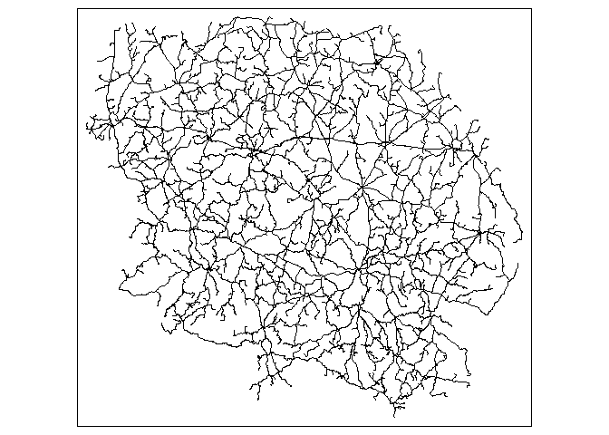<!-- -->

``` r
qtm(r_gh_lyon)
```

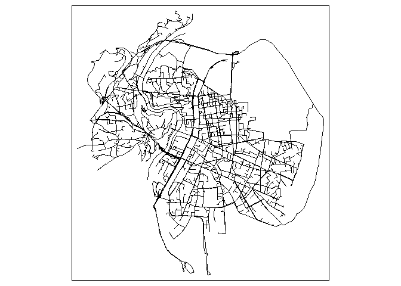<!-- -->

``` r
qtm(r_gh_paris)
```

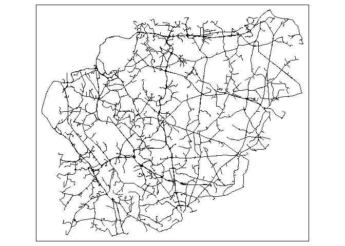<!-- --> and
unfortunately we can’t have the matrix from graphhopper because this
feature is not opensource

## Third API: OpenTripPlanner

OTP is the oldest open source routing project and it originated from
several agencies in the US.

I advise to download the dev version of the r package because its the
only way that worked for me.

``` r
if (!require('remotes')){
  install.packages('remotes')
}
library('remotes')
if (!require('opentripplanner')){
  remotes::install_github('ropensci/opentripplanner')
}
library('opentripplanner')
if (!require('RcppSimdJson')){
  install.packages('RcppSimdJson')
}
library('RcppSimdJson')
```

Then we build the graph with the osm.pbf file that you put (that dont
need to rebuild after).

The osm.pbf files need to be put into the
OTP/graphs/&lt;name-of-the-osm.pbf-directory&gt; with a name that you
will call for building and setting the instances (here creuse, lyon and
paris).

``` r
#setting up the path

path_data <- file.path("C:/Users/Public", "OTP")
dir.create(path_data)
path_otp <- otp_dl_jar(path_data, cache = FALSE)

#building the graphs :

log_creuse <- otp_build_graph(otp = path_otp, dir = path_data, router = 'creuse', memory = 4294)
log_lyon <- otp_build_graph(otp = path_otp, dir = path_data, router = 'lyon', memory = 4294)
log_paris <- otp_build_graph(otp = path_otp, dir = path_data, router = 'paris', memory = 4294)
```

We put the coordinates of the osrm results back in sf format to process
them all at once

``` r
#creuse
point_sfc_creuse <- st_sfc(NA, crs = 4326)
for (i in 1:length(coord_osrm_creuse)) {
  point_sfc_creuse[i] <- st_point(coord_osrm_creuse[[i]][[1]])
}
point_sfc_creuseb <- st_sfc(NA, crs = 4326)
for (i in 1:length(coord_osrm_creuse)) {
  point_sfc_creuseb[i] <- st_point(coord_osrm_creuse[[i]][[2]])
}
point_sf_creuse <- st_sf(point_sfc_creuse)
point_sf_creuse$id <- 1:nrow(point_sf_creuse)
point_sf_creuseb <- st_sf(point_sfc_creuseb)
point_sf_creuseb$id <- 1:nrow(point_sf_creuseb)

#lyon
point_sfc_lyon <- st_sfc(NA, crs = 4326)
for (i in 1:length(coord_osrm_lyon)) {
  point_sfc_lyon[i] <- st_point(coord_osrm_lyon[[i]][[1]])
}
point_sfc_lyonb <- st_sfc(NA, crs = 4326)
for (i in 1:length(coord_osrm_lyon)) {
  point_sfc_lyonb[i] <- st_point(coord_osrm_lyon[[i]][[2]])
}

point_sf_lyon <- st_sf(point_sfc_lyon)
point_sf_lyon$id <- 1:nrow(point_sf_lyon)
point_sf_lyonb <- st_sf(point_sfc_lyonb)
point_sf_lyonb$id <- 1:nrow(point_sf_lyonb)
#idf
point_sfc_paris <- st_sfc(NA, crs = 4326)
for (i in 1:length(coord_osrm_paris)) {
  point_sfc_paris[i] <- st_point(coord_osrm_paris[[i]][[1]])
}
point_sfc_parisb <- st_sfc(NA, crs = 4326)
for (i in 1:length(coord_osrm_paris)) {
  point_sfc_parisb[i] <- st_point(coord_osrm_paris[[i]][[2]])
}

point_sf_paris <- st_sf(point_sfc_paris)
point_sf_paris$id <- 1:nrow(point_sf_paris)
point_sf_parisb <- st_sf(point_sfc_parisb)
point_sf_parisb$id <- 1:nrow(point_sf_parisb)
```

Then we process the itineraries from the instance (you can process
faster with ncores = 2 or more in fonction of the cores of your
processor -1) then stop and set and connect the local instance for the
other region

``` r
#for creuse
log_creuse2 <- otp_setup(otp = path_otp, dir =  path_data, router = 'creuse')
otpcon <- otp_connect(router = 'creuse')


route_otp_creuse <- otp_plan(otpcon,
                             point_sf_creuse,
                             point_sf_creuseb,
                             fromID = as.character(point_sf_creuse$id),
                             toID = as.character(point_sf_creuseb$id),
                             ncores = 3)
qtm(route_otp_creuse)
otp_stop()

#For lyon
log_lyon2 <- otp_setup(otp = path_otp, dir =  path_data, router = 'lyon')
otpcon <- otp_connect(router = 'lyon')

route_otp_lyon <- otp_plan(otpcon,
                           point_sf_lyon,
                           point_sf_lyonb,
                           fromID = as.character(point_sf_lyon$id),
                           toID = as.character(point_sf_lyonb$id),
                           ncores = 3)
qtm(route_otp_lyon)
otp_stop()

#for paris

log_paris2 <- otp_setup(otp = path_otp, dir =  path_data, router = 'paris')
otpcon <- otp_connect(router = 'paris')

route_otp_paris <- otp_plan(otpcon,
                          point_sf_paris,
                          point_sf_parisb,
                          fromID = as.character(point_sf_paris$id),
                          toID = as.character(point_sf_parisb$id),
                          ncores = 3)
qtm(route_otp_paris)
otp_stop()
```

and we display them after we change their projection for lambert 93

``` r
route_otp_creuse <- readRDS(file = "data/route_otp_creuse.rds")
route_otp_lyon <- readRDS(file = "data/route_otp_lyon.rds")
route_otp_paris <- readRDS(file = "data/route_otp_idf.rds")

route_otp_creuse <- st_transform(route_otp_creuse, 2154)
route_otp_lyon <- st_transform(route_otp_lyon, 2154)
route_otp_paris <- st_transform(route_otp_paris, 2154)

qtm(route_otp_creuse)
```

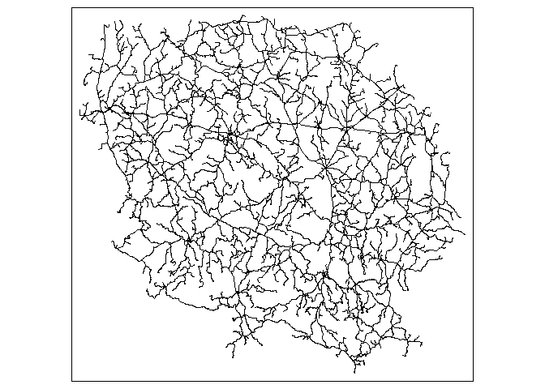<!-- -->

``` r
qtm(route_otp_lyon)
```

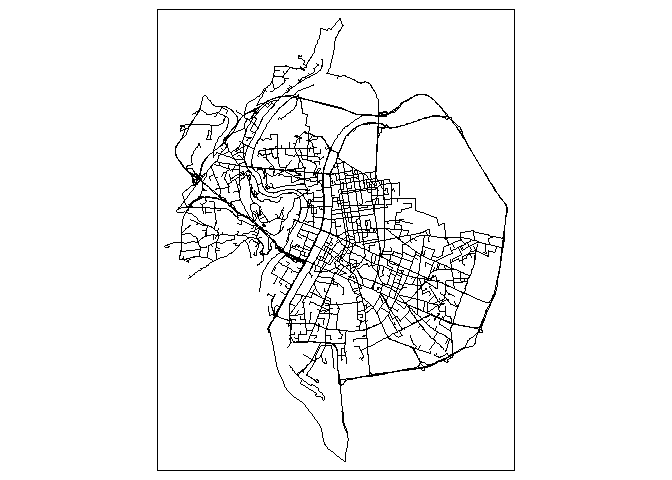<!-- -->

``` r
qtm(route_otp_paris)
```

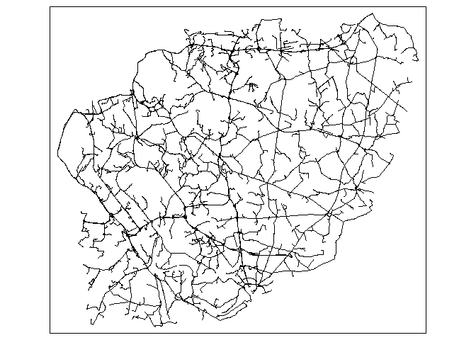<!-- -->

and for stopping the otp java program you do this:

``` r
otp_stop()
```

For opentripplanner the matrix is basically 250 000 itineraries combined
so there is no point to make one

## Fourth API: Mapbox

Mapbox is a big company that contributed a lot to openstreetmap because
it was kinda built on it. so for this API you need a token (you have
some free usage per month) because its not opensource.

``` r
if (!require('mapboxapi')){
  install.packages('mapboxapi')
}
library('mapboxapi')

my_token <- "your token"
mb_access_token(my_token, install = TRUE, overwrite = TRUE)
```

Then we are gonna send the itineraries to the api and wait for an answer
(and assign them an id)

``` r
route_mb_creuse <- list()
for (i in 1:length(coord_osrm_creuse)) {
  route_mb_creuse[[i]] <- mb_directions(
    origin = coord_osrm_creuse[[i]][[1]],
    destination = coord_osrm_creuse[[i]][[2]],
    profile = "driving",
    overview = "full",
    access_token = my_token
  )
}
for (i in 1:length(route_mb_creuse)) {
  route_mb_creuse[[i]]$id <- i
}

route_mb_lyon <- list()
for (i in 1:length(coord_osrm_lyon)) {
  route_mb_lyon[[i]] <- mb_directions(
    origin = coord_osrm_lyon[[i]][[1]],
    destination = coord_osrm_lyon[[i]][[2]],
    profile = "driving",
    overview = "full",
    access_token = my_token
  )
}
for (i in 1:length(route_mb_lyon)) {
  route_mb_lyon[[i]]$id <- i
}

route_mb_paris <- list()
for (i in 1:length(coord_osrm_paris)) {
  route_mb_paris[[i]] <- mb_directions(
    origin = coord_osrm_paris[[i]][[1]],
    destination = coord_osrm_paris[[i]][[2]],
    profile = "driving",
    overview = "full",
    access_token = my_token
 )
}
for (i in 1:length(route_mb_paris)) {
  route_mb_paris[[i]]$id <- i
}
```

then you can display the results, after putting them in the same
projection as the others

``` r
route_mb_creuse <- readRDS(file = "data/route_mb_creuse.rds")
route_mb_lyon <- readRDS(file = "data/route_mb_lyon.rds")
route_mb_paris <- readRDS(file = "data/route_mb_idf.rds")

r_mb_creuse <- bind_rows(route_mb_creuse)
r_mb_lyon <- bind_rows(route_mb_lyon)
r_mb_paris <- bind_rows(route_mb_paris)

r_mb_creuse <- st_transform(r_mb_creuse, 2154)
r_mb_lyon <- st_transform(r_mb_lyon, 2154)
r_mb_paris <- st_transform(r_mb_paris, 2154)

qtm(r_mb_creuse)
```

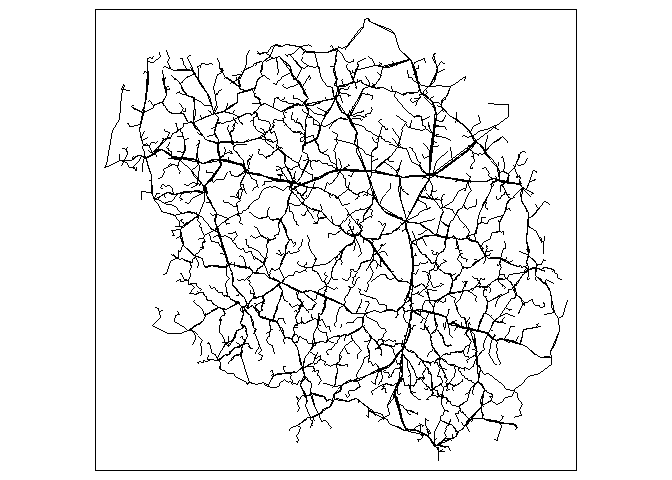<!-- -->

``` r
qtm(r_mb_lyon)
```

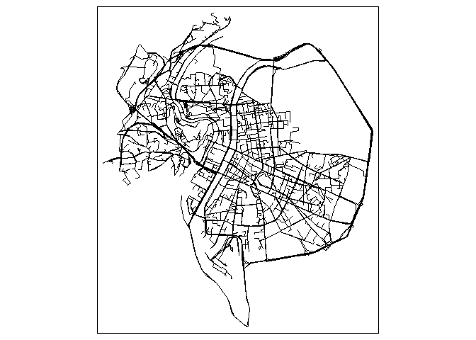<!-- -->

``` r
qtm(r_mb_paris)
```

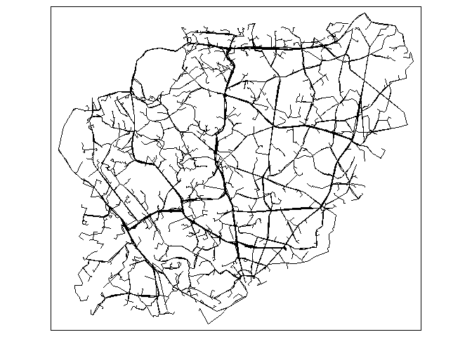<!-- -->

For mapbox matrix we used the mb\_matrix() function wich takes sfc
points, its likely to take a bit of time because we put a sys.sleep()
for the limit rate of the mapbox api. Its also much more than the free
limit but if you ask the api they dont restrict you instantly but the
next day so you have the time to call all of them.

``` r
#matrix for creuse
matrix_mb_creuse <- matrix(nrow = 500, ncol = 500, dimnames = list(1:500,501:1000))
for(c in seq(0,490,10)){
  for(r in seq(0,490,10)){
    m_mb_creuse <- mb_matrix(
      origins = point_sfc_creuse[(c+1):(c+10)],
      destinations = point_sfc_creuseb[(r+1):(r+10)],
      access_token = my_token
      )
    matrix_mb_creuse[(c+1):(c+10),(r+1):(r+10)] <- m_mb_creuse
    Sys.sleep(0.9)
  }
}
saveRDS(object = matrix_mb_creuse, file = "data/matrix_mb_creuse.rds")

# matrix for lyon

matrix_mb_lyon <- matrix(nrow = 500, ncol = 500, dimnames = list(1:500,501:1000))
for(c in seq(0,490,10)){
  for(r in seq(0,490,10)){
    m_mb_lyon <- mb_matrix(
      origins = point_sfc_lyon[(c+1):(c+10)],
      destinations = point_sfc_lyonb[(r+1):(r+10)],
      access_token = my_token
    )
    matrix_mb_lyon[(c+1):(c+10),(r+1):(r+10)] <- m_mb_lyon
    Sys.sleep(0.9)
  }
}
saveRDS(object = matrix_mb_lyon, file = "data/matrix_mb_lyon.rds")

# matrix for paris

matrix_mb_paris <- matrix(nrow = 500, ncol = 500, dimnames = list(1:500,501:1000))
for(c in seq(0,490,10)){
  for(r in seq(0,490,10)){
    m_mb_paris <- mb_matrix(
      origins = point_sfc_paris[(c+1):(c+10)],
      destinations = point_sfc_parisb[(r+1):(r+10)],
      access_token = my_token
    )
    matrix_mb_paris[(c+1):(c+10),(r+1):(r+10)] <- m_mb_paris
    Sys.sleep(0.9)
  }
}
saveRDS(object = matrix_mb_paris, file = "data/matrix_mb_paris.rds")
```

``` r
matrix_mb_creuse <- readRDS(file = "data/matrix_mb_creuse.rds")
matrix_mb_lyon <- readRDS(file = "data/matrix_mb_lyon.rds")
matrix_mb_paris <- readRDS(file = "data/matrix_mb_paris.rds")
```

## Fifth API: Googlemaps

Everybody know google maps, its a reference for our analysis test. You
also have to signup for a key because its not opensource.

``` r
if (!require('mapsapi')){
  install.packages('mapsapi')
}
library('mapsapi')

key = "your key"
```

Same thing that for mapbox (with an id)

``` r
route_maps_creuse <- list()
 for (i in 1:length(coord_osrm_creuse)) {
   doc <- mp_directions(
     origin = coord_osrm_creuse[[i]][[1]],
     destination = coord_osrm_creuse[[i]][[2]],
     key = key,
     quiet = TRUE
   )
   route_maps_creuse[[i]] <- mp_get_routes(doc)
}
for (i in 1:length(route_maps_creuse)) {
  route_maps_creuse[[i]]$id <- i
}

route_maps_lyon <- list()
for (i in 1:length(coord_osrm_lyon)) {
  doc <- mp_directions(
   origin = coord_osrm_lyon[[i]][[1]],
    destination = coord_osrm_lyon[[i]][[2]],
    key = key,
    quiet = TRUE
  )
  route_maps_lyon[[i]] <- mp_get_routes(doc)
}
for (i in 1:length(route_maps_lyon)) {
  route_maps_lyon[[i]]$id <- i
}

route_maps_paris <- list()
for (i in 1:length(coord_osrm_paris)) {
  doc <- mp_directions(
    origin = coord_osrm_paris[[i]][[1]],
    destination = coord_osrm_paris[[i]][[2]],
    key = key,
    quiet = TRUE
  )
  route_maps_paris[[i]] <- mp_get_routes(doc)
}
for (i in 1:length(route_maps_paris)) {
  route_maps_paris[[i]]$id <- i
}
```

and we display the results (after putting them in sf and transforming
the results in lambert 93)

``` r
route_maps_creuse <- readRDS(file = "data/route_maps_creuse.rds")
route_maps_lyon <- readRDS(file = "data/route_maps_lyon.rds")
route_maps_paris <- readRDS(file = "data/route_maps_idf.rds")

r_maps_creuse <- bind_rows(route_maps_creuse)
r_maps_lyon <- bind_rows(route_maps_lyon)
r_maps_paris<- bind_rows(route_maps_paris)

r_maps_creuse <- st_transform(r_maps_creuse, 2154)
r_maps_lyon <- st_transform(r_maps_lyon, 2154)
r_maps_paris <- st_transform(r_maps_paris, 2154)

qtm(r_maps_creuse)
```

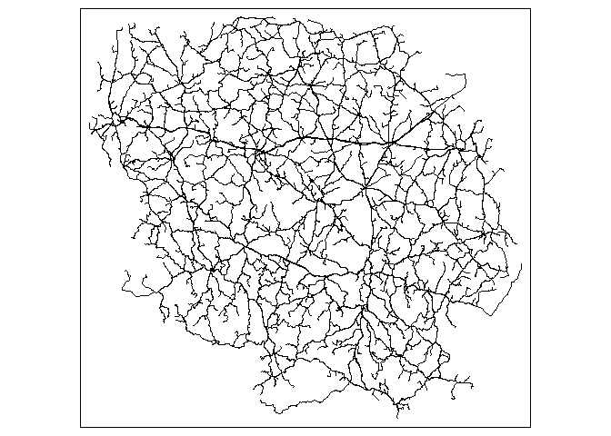<!-- -->

``` r
qtm(r_maps_lyon)
```

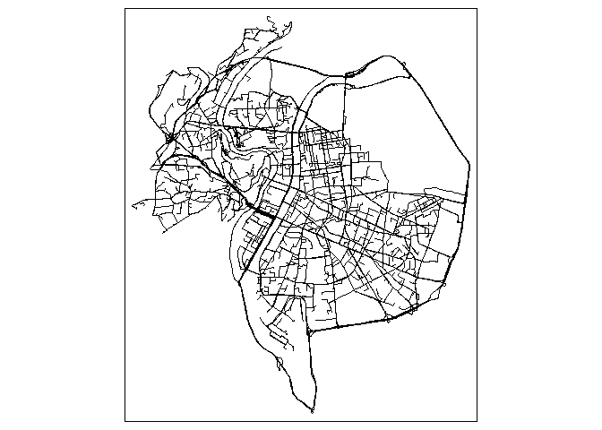<!-- -->

``` r
qtm(r_maps_paris)
```

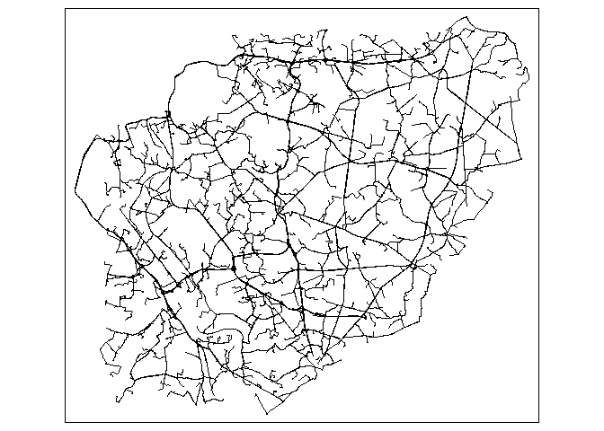<!-- -->

For the matrix googlemaps its almost like mapbox but we use mp\_matrix()
and mp\_get\_matrix() to have the right format from the json response of
the API. Its a little quicker thant mapbox because of the less limited
rate of call.

``` r
matrix_maps_creuse <- matrix(nrow = 500, ncol = 500, dimnames = list(1:500,501:1000))
for(c in seq(0,490,10)){
  for(r in seq(0,490,10)){
     doc <- mp_matrix(
      origins = point_sfc_creuse[(c+1):(c+10)],
      destinations = point_sfc_creuseb[(r+1):(r+10)],
      key = key,
      quiet = TRUE
    )
    m_maps_creuse <- mp_get_matrix(doc, value = "duration_s")
    matrix_maps_creuse[(c+1):(c+10),(r+1):(r+10)] <- m_maps_creuse
    Sys.sleep(0.2)
  }
}
saveRDS(object = matrix_maps_creuse, file = "data/matrix_maps_creuse.rds")

matrix_maps_creuse[0:10,0:10] /60
matrix_maps_lyon <- matrix(nrow = 500, ncol = 500, dimnames = list(1:500,501:1000))
for(c in seq(0,490,10)){
  for(r in seq(0,490,10)){
    doc <- mp_matrix(
      origins = point_sfc_lyon[(c+1):(c+10)],
      destinations = point_sfc_lyonb[(r+1):(r+10)],
      key = key,
      quiet = TRUE
    )
    m_maps_lyon <- mp_get_matrix(doc, value = "duration_s")
    matrix_maps_lyon[(c+1):(c+10),(r+1):(r+10)] <- m_maps_lyon
    Sys.sleep(0.2)
  }
}
saveRDS(object = matrix_maps_lyon, file = "data/matrix_maps_lyon.rds")

matrix_maps_paris <- matrix(nrow = 500, ncol = 500, dimnames = list(1:500,501:1000))
for(c in seq(0,490,10)){
  for(r in seq(0,490,10)){
    doc <- mp_matrix(
      origins = point_sfc_paris[(c+1):(c+10)],
      destinations = point_sfc_parisb[(r+1):(r+10)],
      key = key,
      quiet = TRUE
    )
    m_maps_paris <- mp_get_matrix(doc, value = "duration_s")
    matrix_maps_paris[(c+1):(c+10),(r+1):(r+10)] <- m_maps_paris
    Sys.sleep(0.2)
  }
}
saveRDS(object = matrix_maps_paris, file = "data/matrix_maps_paris.rds")
```

``` r
matrix_maps_creuse <- readRDS(file = "data/matrix_maps_creuse.rds")
matrix_maps_lyon <- readRDS(file = "data/matrix_maps_lyon.rds")
matrix_maps_paris <- readRDS(file = "data/matrix_maps_paris.rds")
```

## Sixth API: OpenRouteService

ORS is opensource and made by a german university (heidelberg) and it is
a fork of GraphHopper. So you can make your own server (on docker) but
you also can signup for an api key from their server wich is pretty
generous.

``` r
if (!require('openrouteservice')){
  remotes::install_github('GIScience/openrouteservice-r')
}
library('openrouteservice')

ors_api_key("your_key")
```

Then same thing (with an id) except you might have to retry at each
error with i+1 and they are a lot of errors for Lyon

``` r
route_ors_creuse <- list()
for (i in 1:length(coord_osrm_creuse)) {
  route_ors_creuse[[i]] <- ors_directions(coord_osrm_creuse[[i]], format="geojson", output = "sf")
}

route_ors_lyon <- list()
for (i in 1:length(coord_osrm_lyon)) {
  route_ors_lyon[[i]] <- ors_directions(coord_osrm_lyon[[i]], format="geojson", output = "sf")
}

route_ors_paris <- list()
for (i in 1:length(coord_osrm_paris)) {
  route_ors_paris[[i]] <- ors_directions(coord_osrm_paris[[i]], format="geojson", output = "sf")
}
```

``` r
route_ors_creuse <- readRDS(file = "data/route_ors_creuse.rds")
route_ors_lyon <- readRDS(file = "data/route_ors_lyon.rds")
route_ors_paris <- readRDS(file = "data/route_ors_idf.rds")
for (i in 1:length(route_ors_creuse)) {
  route_ors_creuse[[i]]$id <- i
}
for (i in 1:length(route_ors_lyon)) {
  route_ors_lyon[[i]]$id <- i
}
for (i in 1:length(route_ors_paris)) {
  route_ors_paris[[i]]$id <- i
}
```

and we display that (sf and transforming into lambert 93)

``` r
r_ors_creuse <- bind_rows(route_ors_creuse)
r_ors_lyon <- bind_rows(route_ors_lyon)
r_ors_paris <- bind_rows(route_ors_paris)

r_ors_creuse <- st_transform(r_ors_creuse, 2154)
r_ors_lyon <- st_transform(r_ors_lyon, 2154)
r_ors_paris <- st_transform(r_ors_paris, 2154)

qtm(r_ors_creuse)
```

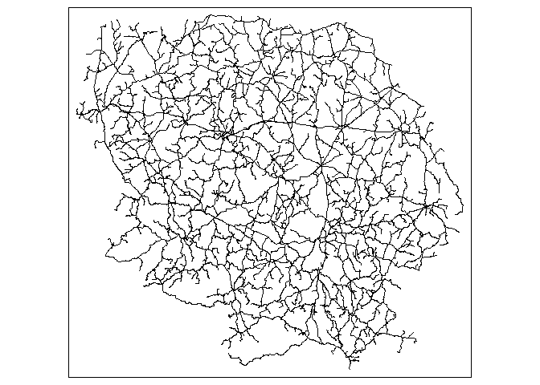<!-- -->

``` r
qtm(r_ors_lyon)
```

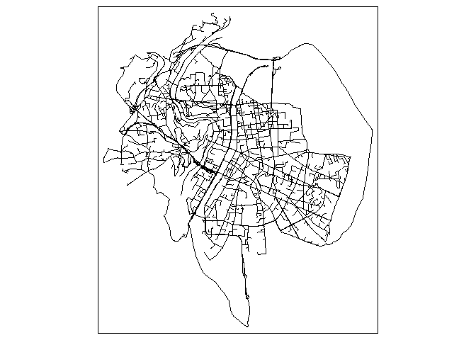<!-- -->

``` r
qtm(r_ors_paris)
```

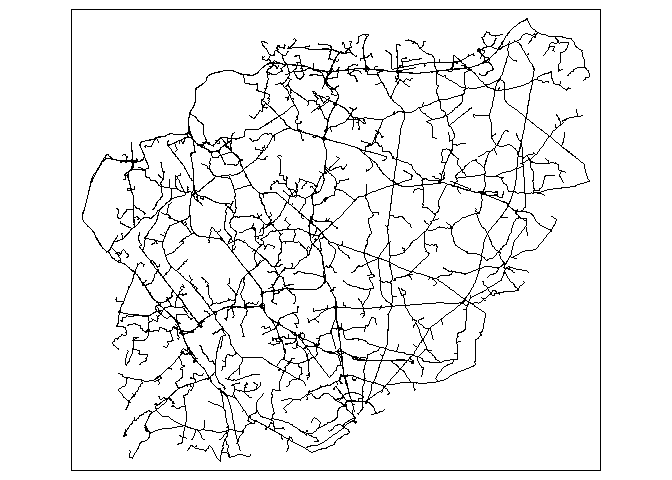<!-- -->

For ORS matrix we used ors\_matrix() with a dataframe of the
coord\_osrm.

``` r
df_coord_creuse <- bind_rows(coord_osrm_creuse)
df_coord_lyon <- bind_rows(coord_osrm_lyon)
df_coord_paris <- bind_rows(coord_osrm_paris)
#creuse
matrix_ors_creuse <- matrix(nrow = 500, ncol = 500,dimnames = list(1:500,501:1000))
for(c in seq(0,900,100)){
  for(r in seq(0,900,100)){
    m_ors_creuse <- ors_matrix(locations = df_coord_creuse, sources = seq((c),(c+99),2), destinations = seq((r+1),(r+99),2))
    matrix_ors_creuse[((c/2)+1):((c/2)+50),((r/2)+1):((r/2)+50)] <- m_ors_creuse$durations / 60
  }
}
#lyon
matrix_ors_lyon <- matrix(nrow = 500, ncol = 500,dimnames = list(1:500,501:1000))
for(c in seq(0,900,100)){
  for(r in seq(0,900,100)){
    m_ors_lyon <- ors_matrix(locations = df_coord_lyon, sources = seq((c),(c+99),2), destinations = seq((r+1),(r+99),2))
    matrix_ors_creuse[((c/2)+1):((c/2)+50),((r/2)+1):((r/2)+50)] <- m_ors_lyon$durations / 60
  }
}

#paris
matrix_ors_paris <- matrix(nrow = 500, ncol = 500,dimnames = list(1:500,501:1000))
for(c in seq(0,900,100)){
  for(r in seq(0,900,100)){
    m_ors_paris <- ors_matrix(locations = df_coord_idf, sources = seq((c),(c+99),2), destinations = seq((r+1),(r+99),2))
    matrix_ors_paris[((c/2)+1):((c/2)+50),((r/2)+1):((r/2)+50)] <- m_ors_paris$durations / 60
  }
}
```

``` r
matrix_ors_creuse <- readRDS(file = "data/matrix_ors_creuse.rds")
matrix_ors_lyon <- readRDS(file = "data/matrix_ors_lyon.rds")
matrix_ors_paris <- readRDS(file = "data/matrix_ors_paris.rds")
```

## Seventh API: R5

R5 is also an opensourceproject from conveyal wich is a Urban transport
analysis company so it’s designed for transit routing. For this one you
are gonna need java 11 installed, the r5r package and allocate some
memory.

``` r
if (!require('r5r')){
  install.packages('r5r')
}
library('r5r')

#allocate memory
options(java.parameters = "-Xmx2G")
```

Then we can setup the routing graph and calculate our itineraries,
setting up the cores from where your pbf file is.

``` r
pt_creuse_4326$id <- 1:nrow(pt_creuse_4326)
pt_creuseb_4326$id <- 1:nrow(pt_creuseb_4326)
r5r_core <- setup_r5(data_path = "your/data/path/creuse")
mode <- c("CAR")
route_r5r_creuse <- detailed_itineraries(
  r5r_core = r5r_core,
  origins = pt_creuse_4326,
  destinations = pt_creuseb_4326,
  mode = mode
)
stop_r5(r5r_core)
rJava::.jgc(R.gc = TRUE)
 
pt_lyon_4326$id <- 1:nrow(pt_lyon_4326)
pt_lyonb_4326$id <- 1:nrow(pt_lyonb_4326)
r5r_core <- setup_r5(data_path = "your/data/path/lyon")
route_r5r_lyon <- detailed_itineraries(
  r5r_core = r5r_core,
  origins = pt_lyon_4326,
  destinations = pt_lyonb_4326,
  mode = mode
)
stop_r5(r5r_core)
rJava::.jgc(R.gc = TRUE)
 
pt_paris_4326$id <- 1:nrow(pt_paris_4326)
pt_parisb_4326$id <- 1:nrow(pt_parisb_4326)
r5r_core <- setup_r5(data_path = "your/data/path/paris")
route_r5r_paris <- detailed_itineraries(
  r5r_core = r5r_core,
  origins = pt_paris_4326,
  destinations = pt_parisb_4326,
  mode = mode
)
stop_r5(r5r_core)
rJava::.jgc(R.gc = TRUE)
```

and we display the itineraries (wich are already sf so we can transform
them directly into lambert 93)

``` r
route_r5r_creuse <- readRDS(file = "data/route_r5r_creuse.rds")
route_r5r_lyon <- readRDS(file = "data/route_r5r_lyon.rds")
route_r5r_paris <- readRDS(file = "data/route_r5r_idf.rds")

route_r5r_creuse <- st_transform(route_r5r_creuse, 2154)
route_r5r_lyon <- st_transform(route_r5r_lyon, 2154)
route_r5r_paris <- st_transform(route_r5r_paris, 2154)

qtm(route_r5r_creuse)
```

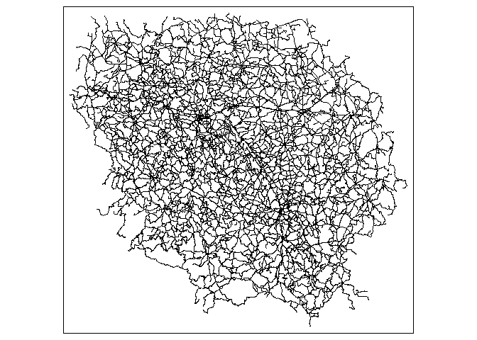<!-- -->

``` r
qtm(route_r5r_lyon)
```

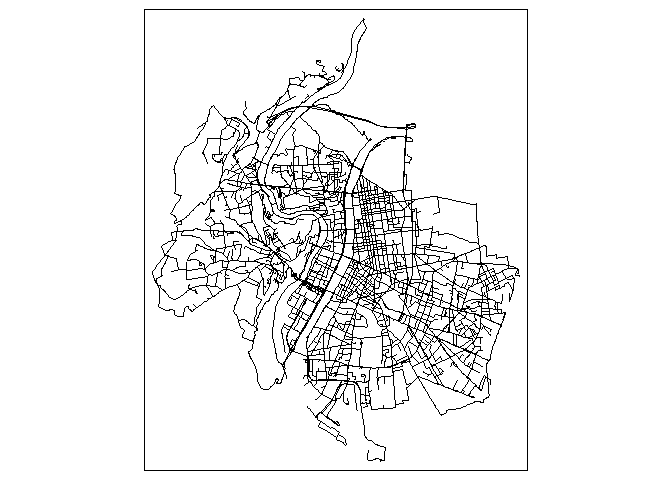<!-- -->

``` r
qtm(route_r5r_paris)
```

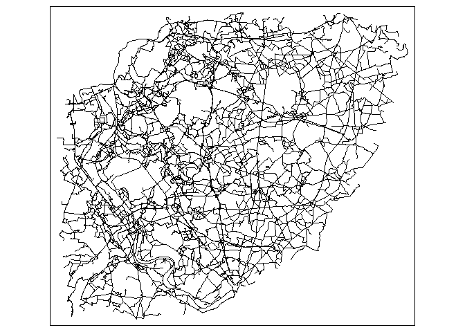<!-- -->

for the r5r matrix we used travel\_time\_matrix() but it is not made for
big networks so we couldnt make more than the creuse one

``` r
r5r_core <- setup_r5(data_path = "your/data/path/creuse")
matrix_r5r_creuse <- travel_time_matrix(r5r_core = r5r_core,
                                        origins = point_sf_creuse,
                                        destinations = point_sf_creuseb,
                                        mode = mode)
stop_r5(r5r_core)
rJava::.jgc(R.gc = TRUE)

r5r_core <- setup_r5(data_path = "your/data/path/lyon")
matrix_r5r_lyon <- travel_time_matrix(r5r_core = r5r_core,
                                        origins = point_sf_lyon,
                                        destinations = point_sf_lyonb,
                                        mode = mode)
stop_r5(r5r_core)
rJava::.jgc(R.gc = TRUE)

r5r_core <- setup_r5(data_path = "your/data/path/paris")
matrix_r5r_idf <- travel_time_matrix(r5r_core = r5r_core,
                                        origins = point_sf_idf,
                                        destinations = point_sf_idfb,
                                        mode = mode)
stop_r5(r5r_core)
rJava::.jgc(R.gc = TRUE)
```

``` r
matrix_r5r_creuse <- readRDS(file = "data/matrix_r5r_creuse.rds")
```

Now that we have all our routes in sf we can put them back into lambert
93 to have only one projection

``` r
r_ors_creuse <- st_transform(r_ors_creuse, 2154)
r_ors_lyon <- st_transform(r_ors_lyon, 2154)
r_ors_paris <- st_transform(r_ors_paris, 2154)

r_mb_creuse <- st_transform(r_mb_creuse, 2154)
r_mb_lyon <- st_transform(r_mb_lyon, 2154)
r_mb_paris <- st_transform(r_mb_paris, 2154)

r_maps_creuse <- st_transform(r_maps_creuse, 2154)
r_maps_lyon <- st_transform(r_maps_lyon, 2154)
r_maps_paris <- st_transform(r_maps_paris, 2154)

r_gh_creuse <- st_transform(r_gh_creuse, 2154)
r_gh_lyon <- st_transform(r_gh_lyon, 2154)
r_gh_paris <- st_transform(r_gh_paris, 2154)

route_otp_creuse <- st_transform(route_otp_creuse, 2154)
route_otp_lyon <- st_transform(route_otp_lyon, 2154)
route_otp_paris <- st_transform(route_otp_paris, 2154)

route_r5r_creuse <- st_transform(route_r5r_creuse, 2154)
route_r5r_lyon <- st_transform(route_r5r_lyon, 2154)
route_r5r_paris <- st_transform(route_r5r_paris, 2154)
```

## Comparison between APIs

We are gonna make a dataframe with every time of each route for each
API. First we have to replace the nonexistent value by 0 in the ors
routes to have 500 values and then we have to take the second element of
summary which is duration because the ors sf routes are not very
convenient.

``` r
for (i in 1:length(r_ors_creuse[[1]])) {
  if(is.null(r_ors_creuse$summary[[i]]$duration)){
    r_ors_creuse$summary[[i]]$distance <- 0
    r_ors_creuse$summary[[i]]$duration <- 0
    print(i)
  }
}
```

    ## [1] 476

``` r
for (i in 1:length(r_ors_lyon[[1]])) {
  if(is.null(r_ors_lyon$summary[[i]]$duration)){
    r_ors_lyon$summary[[i]]$distance <- 0
    r_ors_lyon$summary[[i]]$duration <- 0
    print(i)
  }
}
```

    ## [1] 109
    ## [1] 130
    ## [1] 165
    ## [1] 167
    ## [1] 216
    ## [1] 245
    ## [1] 259
    ## [1] 359
    ## [1] 363
    ## [1] 367

``` r
for (i in 1:length(r_ors_paris[[1]])) {
  if(is.null(r_ors_paris$summary[[i]]$duration)){
    r_ors_paris$summary[[i]]$distance <- 0
    r_ors_paris$summary[[i]]$duration <- 0
    print(i)
  }
}
```

    ## [1] 44
    ## [1] 196
    ## [1] 235
    ## [1] 274
    ## [1] 376
    ## [1] 438
    ## [1] 480

``` r
x <- r_ors_creuse$summary
xc <- unname(unlist(lapply(x, FUN = function(x)x[2])))
x <- r_ors_lyon$summary
xl <- unname(unlist(lapply(x, FUN = function(x)x[2])))
x <- r_ors_paris$summary
xp <- unname(unlist(lapply(x, FUN = function(x)x[2])))
```

Then we have to take care of the r5r and otp routes because they dont
have 500 values so we have to add them by id for each region.

``` r
#creuse r5r and otp did not have 500 values so we had to add them to the dataframe by id
comparison_creuse <- data.frame("id" = sf_route_creuse$src, "osrm"= sf_route_creuse$duration, "graphhopper" = r_gh_creuse$time /60000, "mapbox" = r_mb_creuse$duration, "maps" = r_maps_creuse$duration_s /60, "ors" = xc /60)

duration_r5r_creuse <- data.frame("id" = route_r5r_creuse$toId, "r5r" = route_r5r_creuse$total_duration)
duration_otp_creuse <- data.frame("id" = route_otp_creuse$fromPlace, "otp" = route_otp_creuse$duration /60)
comparison_creuse <- merge.data.frame(comparison_creuse, duration_r5r_creuse, by = "id", all = TRUE)
comparison_creuse <- merge.data.frame(comparison_creuse, duration_otp_creuse, by = "id", all = TRUE)
comparison_creuse <- transform(comparison_creuse, id = as.numeric(id))

#lyon otp did not had the 500 values so we had to add it by id
comparison_lyon <- data.frame("id" = sf_route_lyon$src, "osrm"= sf_route_lyon$duration, "graphhopper" = r_gh_lyon$time /60000, "mapbox" = r_mb_lyon$duration, "maps" = r_maps_lyon$duration_s /60, "ors" = xl /60, "r5r" = route_r5r_lyon$total_duration)
duration_otp_lyon <- data.frame("id" = route_otp_lyon$fromPlace, "otp" = route_otp_lyon$duration / 60)
comparison_lyon <- merge.data.frame(comparison_lyon, duration_otp_lyon, by = "id", all = TRUE)
comparison_lyon <- transform(comparison_lyon, id = as.numeric(id))

#paris otp did not had the 500 values so we had to add it by id
comparison_paris <- data.frame("id" = sf_route_paris$src, "osrm"= sf_route_paris$duration, "graphhopper" = r_gh_paris$time /60000, "mapbox" = r_mb_paris$duration, "maps" = r_maps_paris$duration_s /60, "ors" = xp /60, "r5r" = route_r5r_paris$total_duration)
duration_otp_paris <- data.frame("id" =  route_otp_paris$fromPlace, "otp" = route_otp_paris$duration /60)
comparison_paris <- merge.data.frame(comparison_paris, duration_otp_paris, by = "id", all = TRUE)
comparison_paris <- transform(comparison_paris, id = as.numeric(id))
```

We can make some graph to better visualize the data that we are building

``` r
if (!require('tidyverse')){
  install.packages('tidyverse')
}
library('tidyverse')

#display x = osm apis and y = maps/mapbox points for all regions
comparison_creuse$region <- "creuse"
comparison_lyon$region <- "lyon"
comparison_paris$region <- "paris"
comparison_all <- rbind.data.frame(comparison_creuse, comparison_lyon)
comparison_all <- rbind.data.frame(comparison_all, comparison_paris)

display_maps <- ggplot(comparison_all, mapping = aes(y = maps, colour = region))

display_maps + geom_point(aes(x = osrm)) + ylim(0,max(comparison_all$osrm)) + xlim(0,max(comparison_all$osrm))
```

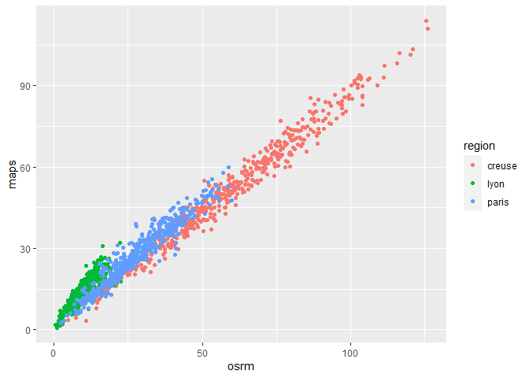<!-- -->

``` r
display_maps + geom_point(aes(x = graphhopper)) + ylim(0,max(comparison_all$graphhopper)) + xlim(0,max(comparison_all$graphhopper))
```

<!-- -->

``` r
display_maps + geom_point(aes(x = otp)) + ylim(0,max(comparison_all$otp, na.rm = TRUE)) + xlim(0,max(comparison_all$otp, na.rm = TRUE))
```

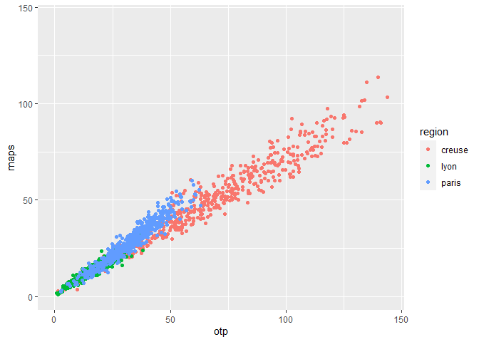<!-- -->

``` r
display_maps + geom_point(aes(x = ors)) + ylim(0,max(comparison_all$ors)) + xlim(0,max(comparison_all$ors))
```

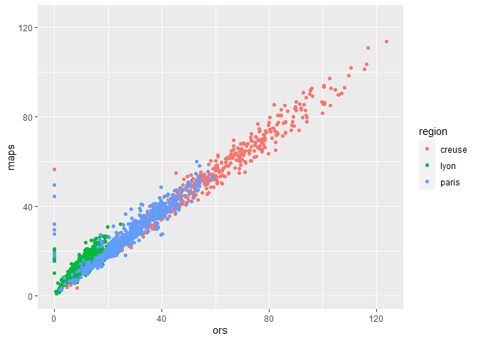<!-- -->

``` r
display_maps + geom_point(aes(x = r5r)) + ylim(0,max(comparison_all$r5r, na.rm = TRUE)) + xlim(0,max(comparison_all$r5r, na.rm = TRUE))
```

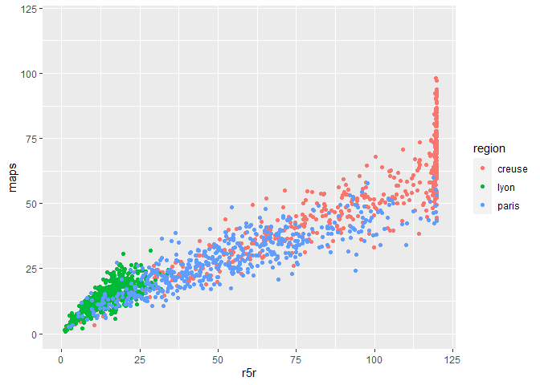<!-- -->

``` r
display_mb <- ggplot(comparison_all, mapping = aes(y = mapbox, colour = region))

display_mb + geom_point(aes(x = osrm)) + ylim(0,max(comparison_all$osrm)) + xlim(0,max(comparison_all$osrm))
```

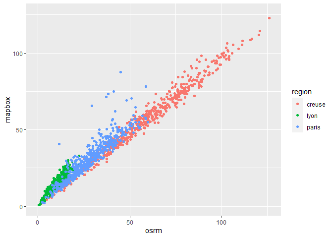<!-- -->

``` r
display_mb + geom_point(aes(x = graphhopper)) + ylim(0,max(comparison_all$graphhopper)) + xlim(0,max(comparison_all$graphhopper))
```

<!-- -->

``` r
display_mb + geom_point(aes(x = otp)) + ylim(0,max(comparison_all$otp, na.rm = TRUE)) + xlim(0,max(comparison_all$otp, na.rm = TRUE))
```

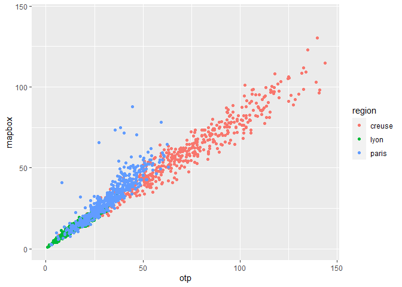<!-- -->

``` r
display_mb + geom_point(aes(x = ors)) + ylim(0,max(comparison_all$ors)) + xlim(0,max(comparison_all$ors))
```

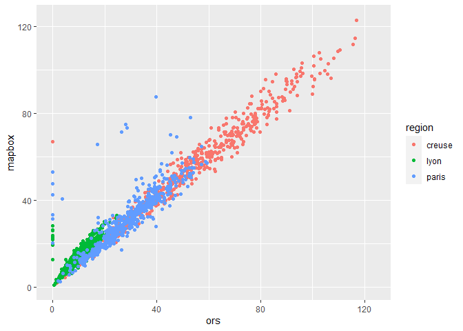<!-- -->

``` r
display_mb + geom_point(aes(x = r5r)) + ylim(0,max(comparison_all$r5r, na.rm = TRUE)) + xlim(0,max(comparison_all$r5r, na.rm = TRUE))
```

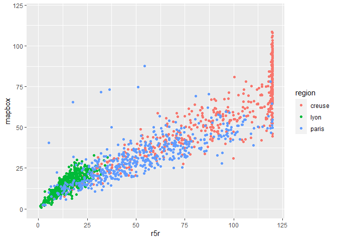<!-- -->

We now can calculate the mean, median and standard deviation but we have
to make the zeros to NA value to not underestimating the values.

``` r
#adding a column with the mean, median and the standard deviation
comparison_creuse[comparison_creuse == 0] <- NA
comparison_lyon[comparison_lyon == 0] <- NA
comparison_paris[comparison_paris == 0] <- NA
#for creuse
comparison_creuse <- comparison_creuse %>% 
  mutate(mean = apply(comparison_creuse[2:8],1,FUN = mean,na.rm = TRUE))
comparison_creuse <- comparison_creuse %>% 
  mutate(median = apply(comparison_creuse[2:8],1,FUN = median,na.rm = TRUE))
comparison_creuse <- comparison_creuse %>% 
  mutate(sd = apply(comparison_creuse[2:8],1,FUN = sd, na.rm = TRUE))
#for lyon
comparison_lyon <- comparison_lyon %>% 
  mutate(mean = apply(comparison_lyon[2:8],1,FUN = mean, na.rm = TRUE))
comparison_lyon <- comparison_lyon %>% 
  mutate(median = apply(comparison_lyon[2:8],1,FUN = median, na.rm = TRUE))
comparison_lyon <- comparison_lyon %>% 
  mutate(sd = apply(comparison_lyon[2:8],1,FUN = sd, na.rm = TRUE))
#for paris
comparison_paris <- comparison_paris %>% 
  mutate(mean = apply(comparison_paris[2:8],1,FUN = mean, na.rm = TRUE))
comparison_paris <- comparison_paris %>% 
  mutate(median = apply(comparison_paris[2:8],1,FUN = median, na.rm = TRUE))
comparison_paris <- comparison_paris %>% 
  mutate(sd = apply(comparison_paris[2:8],1,FUN = sd, na.rm = TRUE))

summary(comparison_creuse)
```

    ##        id             osrm         graphhopper          mapbox       
    ##  Min.   :  1.0   Min.   :  1.90   Min.   :  1.429   Min.   :  1.624  
    ##  1st Qu.:125.8   1st Qu.: 40.17   1st Qu.: 35.086   1st Qu.: 39.328  
    ##  Median :250.5   Median : 57.35   Median : 50.751   Median : 55.485  
    ##  Mean   :250.5   Mean   : 57.60   Mean   : 50.887   Mean   : 55.619  
    ##  3rd Qu.:375.2   3rd Qu.: 75.45   3rd Qu.: 66.808   3rd Qu.: 71.998  
    ##  Max.   :500.0   Max.   :126.03   Max.   :114.831   Max.   :130.236  
    ##                                                                      
    ##       maps              ors               r5r               otp        
    ##  Min.   :  2.617   Min.   :  1.438   Min.   :  1.567   Min.   :  1.45  
    ##  1st Qu.: 34.633   1st Qu.: 37.140   1st Qu.: 62.317   1st Qu.: 47.52  
    ##  Median : 50.075   Median : 53.445   Median : 94.467   Median : 66.17  
    ##  Mean   : 49.876   Mean   : 54.396   Mean   : 86.789   Mean   : 67.83  
    ##  3rd Qu.: 64.771   3rd Qu.: 71.153   3rd Qu.:119.475   3rd Qu.: 89.33  
    ##  Max.   :113.783   Max.   :123.810   Max.   :119.967   Max.   :143.83  
    ##                    NA's   :1         NA's   :9         NA's   :1       
    ##     region               mean             median              sd         
    ##  Length:500         Min.   :  1.718   Min.   :  1.567   Min.   : 0.4065  
    ##  Class :character   1st Qu.: 42.974   1st Qu.: 39.145   1st Qu.: 9.7858  
    ##  Mode  :character   Median : 61.933   Median : 55.457   Median :14.7914  
    ##                     Mean   : 60.503   Mean   : 55.822   Mean   :13.8602  
    ##                     3rd Qu.: 79.469   3rd Qu.: 72.963   3rd Qu.:18.2186  
    ##                     Max.   :124.642   Max.   :124.692   Max.   :27.9716  
    ## 

``` r
summary(comparison_lyon)
```

    ##        id             osrm          graphhopper          mapbox       
    ##  Min.   :  1.0   Min.   : 0.3883   Min.   : 0.2687   Min.   : 0.9219  
    ##  1st Qu.:125.8   1st Qu.: 6.7962   1st Qu.: 5.2273   1st Qu.:10.9093  
    ##  Median :250.5   Median : 9.6350   Median : 7.3287   Median :15.0231  
    ##  Mean   :250.5   Mean   : 9.9670   Mean   : 7.6422   Mean   :15.0980  
    ##  3rd Qu.:375.2   3rd Qu.:12.7546   3rd Qu.: 9.9409   3rd Qu.:19.2638  
    ##  Max.   :500.0   Max.   :25.5667   Max.   :17.6486   Max.   :32.8873  
    ##                                                                       
    ##       maps              ors              r5r             otp         
    ##  Min.   : 0.8167   Min.   : 0.495   Min.   : 1.00   Min.   : 0.8333  
    ##  1st Qu.:10.4250   1st Qu.: 7.160   1st Qu.:10.03   1st Qu.:11.7583  
    ##  Median :14.1750   Median :10.502   Median :14.04   Median :16.8583  
    ##  Mean   :14.1373   Mean   :10.692   Mean   :14.59   Mean   :17.0406  
    ##  3rd Qu.:17.7375   3rd Qu.:13.977   3rd Qu.:19.09   3rd Qu.:21.9167  
    ##  Max.   :32.0000   Max.   :24.622   Max.   :35.23   Max.   :38.1500  
    ##                    NA's   :10                       NA's   :44       
    ##     region               mean             median              sd        
    ##  Length:500         Min.   : 0.8891   Min.   : 0.8333   Min.   :0.2486  
    ##  Class :character   1st Qu.: 9.0546   1st Qu.: 9.2845   1st Qu.:2.6254  
    ##  Mode  :character   Median :12.6743   Median :12.7017   Median :3.6365  
    ##                     Mean   :12.7142   Mean   :12.8752   Mean   :3.6850  
    ##                     3rd Qu.:16.3552   3rd Qu.:16.4501   3rd Qu.:4.5909  
    ##                     Max.   :27.9438   Max.   :28.5500   Max.   :7.9629  
    ## 

``` r
summary(comparison_paris)
```

    ##        id             osrm         graphhopper         mapbox      
    ##  Min.   :  1.0   Min.   : 2.363   Min.   : 1.851   Min.   : 2.243  
    ##  1st Qu.:125.8   1st Qu.:19.875   1st Qu.:16.958   1st Qu.:21.570  
    ##  Median :250.5   Median :27.453   Median :23.668   Median :30.421  
    ##  Mean   :250.5   Mean   :28.426   Mean   :24.486   Mean   :31.514  
    ##  3rd Qu.:375.2   3rd Qu.:36.573   3rd Qu.:31.300   3rd Qu.:40.260  
    ##  Max.   :500.0   Max.   :59.860   Max.   :52.201   Max.   :87.643  
    ##                                                                    
    ##       maps             ors              r5r               otp        
    ##  Min.   : 2.483   Min.   : 2.057   Min.   :  2.167   Min.   : 2.733  
    ##  1st Qu.:20.163   1st Qu.:20.715   1st Qu.: 32.179   1st Qu.:24.137  
    ##  Median :27.317   Median :28.442   Median : 49.725   Median :32.267  
    ##  Mean   :28.143   Mean   :28.923   Mean   : 52.837   Mean   :32.378  
    ##  3rd Qu.:36.337   3rd Qu.:37.580   3rd Qu.: 70.037   3rd Qu.:40.675  
    ##  Max.   :59.950   Max.   :59.288   Max.   :119.917   Max.   :63.083  
    ##                   NA's   :7                          NA's   :8       
    ##     region               mean           median            sd        
    ##  Length:500         Min.   : 2.40   Min.   : 2.43   Min.   : 0.202  
    ##  Class :character   1st Qu.:22.91   1st Qu.:21.04   1st Qu.: 5.559  
    ##  Mode  :character   Median :31.58   Median :28.58   Median : 8.703  
    ##                     Mean   :32.41   Mean   :29.43   Mean   :10.073  
    ##                     3rd Qu.:41.47   3rd Qu.:38.15   3rd Qu.:13.654  
    ##                     Max.   :68.46   Max.   :59.47   Max.   :29.220  
    ## 

## Correlation

We can also do some correlation with the osm apis and the maps and
mapbox ones:

``` r
cor_maps <- data.frame(row.names = c("osrm", "graphhopper", "otp", "ors", "r5r"))
cor_mb <- data.frame(row.names = c("osrm", "graphhopper", "otp", "ors", "r5r"))

apis_osm <- c("osrm", "graphhopper", "otp", "ors", "r5r")

#for maps
cor_maps <- cor_maps %>% 
  mutate(creuse = apply(
      (comparison_creuse%>%select(all_of(apis_osm))), 2,
      FUN = function(x)cor(x = x, y = comparison_creuse$maps,
                           method = "pearson", use = "complete.obs")))
cor_maps <- cor_maps %>% 
  mutate(lyon = apply(
    (comparison_lyon%>%select(all_of(apis_osm))), 2,
    FUN = function(x)cor(x = x, y = comparison_lyon$maps,
                         method = "pearson", use = "complete.obs")))
cor_maps <- cor_maps %>% 
  mutate(paris = apply(
    (comparison_paris%>%select(all_of(apis_osm))), 2,
    FUN = function(x)cor(x = x, y = comparison_paris$maps,
                         method = "pearson", use = "complete.obs")))
cor_maps <- cor_maps %>% 
  mutate(all = apply(
    (comparison_all%>%select(all_of(apis_osm))), 2,
    FUN = function(x)cor(x = x, y = comparison_all$maps,
                         method = "pearson", use = "complete.obs")))
#for mapbox
cor_mb <- cor_mb %>% 
  mutate(creuse = apply(
    (comparison_creuse%>%select(all_of(apis_osm))), 2,
    FUN = function(x)cor(x = x, y = comparison_creuse$mapbox,
                         method = "pearson", use = "complete.obs")))
cor_mb <- cor_mb %>% 
  mutate(lyon = apply(
    (comparison_lyon%>%select(all_of(apis_osm))), 2,
    FUN = function(x)cor(x = x, y = comparison_lyon$mapbox,
                         method = "pearson", use = "complete.obs")))
cor_mb <- cor_mb %>% 
  mutate(paris = apply(
    (comparison_paris%>%select(all_of(apis_osm))), 2,
    FUN = function(x)cor(x = x, y = comparison_paris$mapbox,
                         method = "pearson", use = "complete.obs")))
cor_mb <- cor_mb %>% 
  mutate(all = apply(
    (comparison_all%>%select(all_of(apis_osm))), 2,
    FUN = function(x)cor(x = x, y = comparison_all$mapbox,
                         method = "pearson", use = "complete.obs")))
cor_maps
```

    ##                creuse      lyon     paris       all
    ## osrm        0.9890222 0.8710077 0.9649219 0.9862802
    ## graphhopper 0.9890639 0.8778636 0.9615468 0.9851608
    ## otp         0.9690857 0.9494589 0.9629948 0.9787470
    ## ors         0.9878334 0.8802467 0.9662823 0.9801087
    ## r5r         0.9025000 0.7703496 0.8754826 0.9356606

``` r
cor_mb
```

    ##                creuse      lyon     paris       all
    ## osrm        0.9887730 0.9386748 0.9174238 0.9822072
    ## graphhopper 0.9876312 0.9286706 0.8928670 0.9784849
    ## otp         0.9732899 0.9709019 0.8942910 0.9729519
    ## ors         0.9858805 0.9321412 0.8841539 0.9711418
    ## r5r         0.8896150 0.8219957 0.7948287 0.9247184

## Distances and sinuosity

We can find the distances with the same method than the durations

``` r
x <- r_ors_creuse$summary
dc <- unname(unlist(lapply(x, FUN = function(x)x[1])))
x <- r_ors_lyon$summary
dl <- unname(unlist(lapply(x, FUN = function(x)x[1])))
x <- r_ors_paris$summary
dp <- unname(unlist(lapply(x, FUN = function(x)x[1])))

comp_creuse <- data.frame("id" = sf_route_creuse$src, "osrm"= sf_route_creuse$distance, "graphhopper" = r_gh_creuse$distance /1000, "mapbox" = r_mb_creuse$distance, "maps" = r_maps_creuse$distance_m /1000, "ors" = dc /1000)

distance_r5r_creuse <- data.frame("id" = route_r5r_creuse$toId, "r5r" = route_r5r_creuse$distance /1000)
distance_otp_creuse <- data.frame("id" = route_otp_creuse$fromPlace, "otp" = route_otp_creuse$distance /1000)
comp_creuse <- merge.data.frame(comp_creuse, distance_r5r_creuse, by = "id", all = TRUE)
comp_creuse <- merge.data.frame(comp_creuse, distance_otp_creuse, by = "id", all = TRUE)
comp_creuse <- transform(comp_creuse, id = as.numeric(id))

#lyon otp did not had the 500 values so we had to add it by id
comp_lyon <- data.frame("id" = sf_route_lyon$src, "osrm"= sf_route_lyon$distance, "graphhopper" = r_gh_lyon$distance /1000, "mapbox" = r_mb_lyon$distance, "maps" = r_maps_lyon$distance_m /1000, "ors" = dl /1000, "r5r" = route_r5r_lyon$distance /1000)
distance_otp_lyon <- data.frame("id" = route_otp_lyon$fromPlace, "otp" = route_otp_lyon$distance /1000)
comp_lyon <- merge.data.frame(comp_lyon, distance_otp_lyon, by = "id", all = TRUE)
comp_lyon <- transform(comp_lyon, id = as.numeric(id))

#paris otp did not had the 500 values so we had to add it by id
comp_paris <- data.frame("id" = sf_route_paris$src, "osrm"= sf_route_paris$distance, "graphhopper" = r_gh_paris$distance /1000 , "mapbox" = r_mb_paris$distance, "maps" = r_maps_paris$distance_m /1000, "ors" = dp /1000 , "r5r" = route_r5r_paris$distance /1000)
distance_otp_paris <- data.frame("id" =  route_otp_paris$fromPlace, "otp" = route_otp_paris$distance /1000)
comp_paris <- merge.data.frame(comp_paris, distance_otp_paris, by = "id", all = TRUE)
comp_paris <- transform(comp_paris, id = as.numeric(id))

comp_creuse$region <- "creuse"
comp_lyon$region <- "lyon"
comp_paris$region <- "paris"
comp_creuse[comp_creuse == 0] <- NA
comp_lyon[comp_lyon == 0] <- NA
comp_paris[comp_paris == 0] <- NA
```

Then we can calculate the euclidian distance for each pair of points

``` r
library(units)

pt_sf_creuse_93 <- st_transform(point_sf_creuse, crs = 2154)
pt_sf_creuseb_93 <- st_transform(point_sf_creuseb, crs = 2154)
pt_sf_lyon_93 <- st_transform(point_sf_lyon, crs = 2154)
pt_sf_lyonb_93 <- st_transform(point_sf_lyonb, crs = 2154)
pt_sf_paris_93 <- st_transform(point_sf_paris, crs = 2154)
pt_sf_parisb_93 <- st_transform(point_sf_parisb, crs = 2154)
# calculating the euclidian distance with st_distance

dist_creuse <- st_distance(pt_sf_creuse_93,pt_sf_creuseb_93, by_element = TRUE)
dist_lyon <- st_distance(pt_sf_lyon_93, pt_sf_lyonb_93, by_element = TRUE)
dist_paris <- st_distance(pt_sf_paris_93, pt_sf_parisb_93, by_element = TRUE)

dist_creuse <- as.numeric(set_units(dist_creuse, km))
dist_lyon <- as.numeric(set_units(dist_creuse, km))
dist_paris <- as.numeric(set_units(dist_paris, km))

dist_creuse <- as.data.frame(dist_creuse)
dist_lyon <- as.data.frame(dist_lyon)
dist_paris <- as.data.frame(dist_paris)

dist_creuse$id <- 1:nrow(dist_creuse)
dist_lyon$id <- 1:nrow(dist_lyon)
dist_paris$id <- 1:nrow(dist_paris)

comp_creuse <- merge.data.frame(comp_creuse, dist_creuse, by = "id")
comp_lyon <- merge.data.frame(comp_lyon, dist_lyon, by = "id")
comp_paris <- merge.data.frame(comp_paris, dist_paris, by = "id")
```

With that we can calculate a sinuosity index

``` r
# calculating the sinuosity index (euclidian distance/ route distance)

diff_creuse <- apply(comp_creuse[2:8], 2, FUN = function(x)x/comp_creuse$dist_creuse)
diff_lyon <- apply(comp_lyon[2:8], 2, FUN = function(x)x/comp_lyon$dist_lyon)
diff_paris <- apply(comp_paris[2:8], 2, FUN = function(x)x/comp_paris$dist_paris)

diff_creuse <- as.data.frame(diff_creuse)
diff_lyon <- as.data.frame(diff_lyon)
diff_paris <- as.data.frame(diff_paris)

diff_creuse$id <- 1:nrow(diff_creuse)
diff_lyon$id <- 1:nrow(diff_lyon)
diff_paris$id <- 1:nrow(diff_paris)

summary(diff_creuse)
```

    ##       osrm        graphhopper        mapbox           maps      
    ##  Min.   :1.103   Min.   :1.102   Min.   :1.103   Min.   :1.133  
    ##  1st Qu.:1.305   1st Qu.:1.287   1st Qu.:1.315   1st Qu.:1.295  
    ##  Median :1.380   Median :1.365   Median :1.402   Median :1.366  
    ##  Mean   :1.416   Mean   :1.393   Mean   :1.436   Mean   :1.395  
    ##  3rd Qu.:1.480   3rd Qu.:1.456   3rd Qu.:1.522   3rd Qu.:1.460  
    ##  Max.   :3.090   Max.   :3.089   Max.   :3.199   Max.   :3.116  
    ##                                                                 
    ##       ors             r5r             otp              id       
    ##  Min.   :1.102   Min.   :1.131   Min.   :1.091   Min.   :  1.0  
    ##  1st Qu.:1.283   1st Qu.:1.410   1st Qu.:1.305   1st Qu.:125.8  
    ##  Median :1.356   Median :1.487   Median :1.389   Median :250.5  
    ##  Mean   :1.387   Mean   :1.526   Mean   :1.420   Mean   :250.5  
    ##  3rd Qu.:1.452   3rd Qu.:1.598   3rd Qu.:1.502   3rd Qu.:375.2  
    ##  Max.   :3.089   Max.   :3.589   Max.   :3.137   Max.   :500.0  
    ##  NA's   :1       NA's   :9       NA's   :1

``` r
summary(diff_lyon)
```

    ##       osrm            graphhopper            mapbox              maps          
    ##  Min.   : 0.003344   Min.   : 0.003342   Min.   : 0.00335   Min.   : 0.007406  
    ##  1st Qu.: 0.087912   1st Qu.: 0.087868   1st Qu.: 0.09381   1st Qu.: 0.092747  
    ##  Median : 0.147786   Median : 0.145689   Median : 0.16149   Median : 0.157803  
    ##  Mean   : 0.268868   Mean   : 0.266788   Mean   : 0.29909   Mean   : 0.305340  
    ##  3rd Qu.: 0.253574   3rd Qu.: 0.259127   3rd Qu.: 0.29649   3rd Qu.: 0.299502  
    ##  Max.   :10.131169   Max.   :10.404577   Max.   :10.55723   Max.   :10.523630  
    ##                                                                                
    ##       ors                r5r                 otp                 id       
    ##  Min.   : 0.00334   Min.   : 0.000756   Min.   : 0.00334   Min.   :  1.0  
    ##  1st Qu.: 0.08924   1st Qu.: 0.092036   1st Qu.: 0.08631   1st Qu.:125.8  
    ##  Median : 0.14550   Median : 0.159215   Median : 0.14766   Median :250.5  
    ##  Mean   : 0.26662   Mean   : 0.293238   Mean   : 0.28746   Mean   :250.5  
    ##  3rd Qu.: 0.25612   3rd Qu.: 0.287052   3rd Qu.: 0.27127   3rd Qu.:375.2  
    ##  Max.   :10.44028   Max.   :10.292113   Max.   :11.08048   Max.   :500.0  
    ##  NA's   :10                             NA's   :44

``` r
summary(diff_paris)
```

    ##       osrm        graphhopper        mapbox           maps      
    ##  Min.   :1.041   Min.   :1.040   Min.   :1.041   Min.   :1.040  
    ##  1st Qu.:1.301   1st Qu.:1.293   1st Qu.:1.345   1st Qu.:1.339  
    ##  Median :1.408   Median :1.393   Median :1.495   Median :1.486  
    ##  Mean   :1.467   Mean   :1.447   Mean   :1.569   Mean   :1.549  
    ##  3rd Qu.:1.561   3rd Qu.:1.527   3rd Qu.:1.675   3rd Qu.:1.666  
    ##  Max.   :4.337   Max.   :4.335   Max.   :6.022   Max.   :5.786  
    ##                                                                 
    ##       ors             r5r             otp              id       
    ##  Min.   :1.043   Min.   :1.129   Min.   :1.040   Min.   :  1.0  
    ##  1st Qu.:1.323   1st Qu.:1.405   1st Qu.:1.352   1st Qu.:125.8  
    ##  Median :1.455   Median :1.499   Median :1.531   Median :250.5  
    ##  Mean   :1.507   Mean   :1.535   Mean   :1.567   Mean   :250.5  
    ##  3rd Qu.:1.627   3rd Qu.:1.609   3rd Qu.:1.711   3rd Qu.:375.2  
    ##  Max.   :4.335   Max.   :4.252   Max.   :4.335   Max.   :500.0  
    ##  NA's   :7                       NA's   :8
