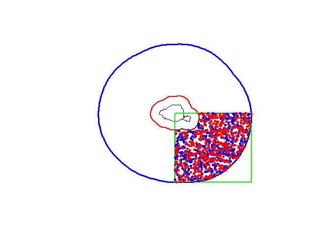
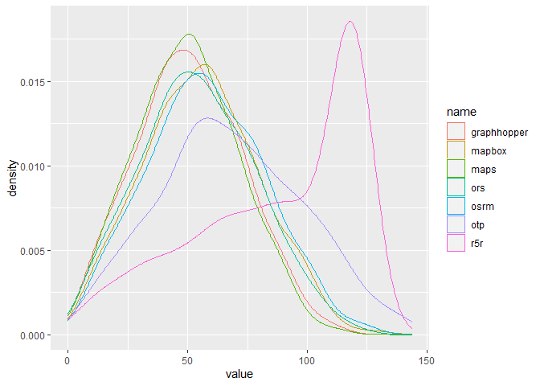
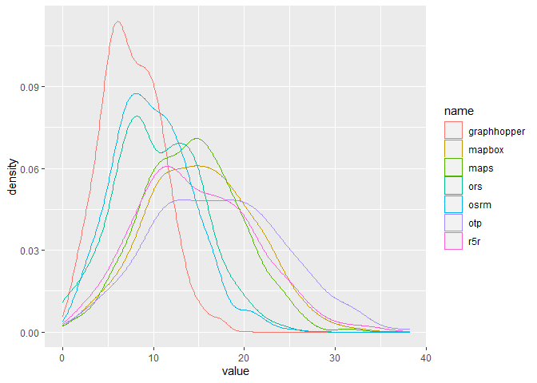
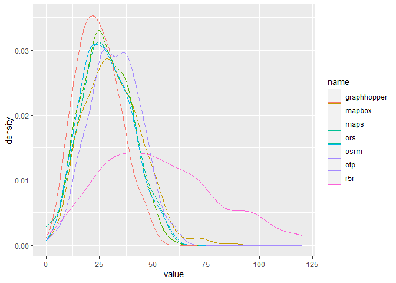

DirectionsAPI
================
Arthur Artaud
3/18/2021

-   [Librabries](#librabries)
-   [Rural points](#rural-points)
-   [Urban points](#urban-points)
-   [Suburban points](#suburban-points)
-   [First API : OSRM](#first-api--osrm)
-   [Second API GraphHopper](#second-api-graphhopper)
-   [Third API: OpenTripPlanner](#third-api-opentripplanner)
-   [Fourth API: Mapbox](#fourth-api-mapbox)
-   [Fifth API: Googlemaps](#fifth-api-googlemaps)
-   [Sixth API: OpenRouteService](#sixth-api-openrouteservice)
-   [Seventh API: R5](#seventh-api-r5)
-   [Comparison between the differents
    API](#comparison-between-the-differents-api)

## Librabries

We first install the libraries needed for general operations

``` r
if (!require('dplyr')){
  install.packages('dplyr')
}
library('dplyr')
if (!require('sf')){
  install.packages('sf')
}
library('sf')
if (!require('leaflet')){
  install.packages('leaflet')
}
library('leaflet')
```

## Rural points

We make 500 random points of origin and 500 points of destinations
within the shp of the departement of Creuse (a rural zone in France)
that we got from the [ADMIN-EXPRESS-COG édition
2020](https://geoservices.ign.fr/documentation/diffusion/telechargement-donnees-libres.html#admin-express)

``` r
creuse <- st_read("data/Creuse.shp", quiet=TRUE)
plot(st_geometry(creuse))
#creation of points
if (!exists("pt_creuse") & !exists("pt_creuse_b")){
  pt_creuse <- st_sample(x = creuse, size = 500)
  pt_creuse_b <- st_sample(x = creuse, size= 500)
}
#display of the points
plot(st_geometry(pt_creuse), add=T, col="red", pch = 20)
plot(st_geometry(pt_creuse_b), add=T, col="blue", pch = 20)
```

<!-- -->

## Urban points

Same thing for the city of Lyon

``` r
lyon <- st_read("data/Lyon.shp", quiet=TRUE)
plot(st_geometry(lyon))
#creation of points
if (!exists("pt_lyon") & !exists("pt_lyon_b")){
  pt_lyon <- st_sample(x = lyon, size = 500)
  pt_lyon_b <- st_sample(x = lyon, size= 500)
}
#display of the points
plot(st_geometry(pt_lyon), add=T, col="red", pch = 20)
plot(st_geometry(pt_lyon_b), add=T, col="blue", pch = 20)
```

<!-- -->

## Suburban points

For the suburban we took the city of Paris, we did a buffer of 5km to
move away from the very dense close suburb.

Then we did another buffer of 30km and made a rectangle of the southwest
side and took the intersection between this and the buffer minus the
first buffer. Then we did the points.

``` r
paris <- st_read("data/Paris.shp", quiet=TRUE)
#creation of the buffers
paris_b5 <- st_buffer(paris, 5000)
paris_b30_5 <- st_buffer(paris_b5, 30000)
plot(st_geometry(paris_b30_5), lwd = 3, border = "blue")
plot(st_geometry(paris_b5), add = T, lwd=2, border = "red")
plot(st_geometry(paris), add = T)
#creation of the rectangle
m <- rbind(c(652083,6862280), c(696084,6862280), c(696084,6822480), 
           c(652083,6822480), c(652083,6862280))
p <- st_sf(st_sfc(st_polygon(list(m))), crs = st_crs(paris))
plot(p, border="green", lwd=2, add=T)
#intersection
paris_z <- st_intersection(x = p, y = paris_b30_5)
paris_f <- st_difference(x = paris_z, y = paris_b5)
plot(st_geometry(paris_f), add=T)
#creation of points
if(!exists("pt_paris") & !exists("pt_paris_b")){
  pt_paris <- st_sample(x = paris_f, size = 500)
  pt_paris_b <- st_sample(x = paris_f, size= 500)
}
#display of the points
plot(st_geometry(pt_paris_b), add=T, col="blue", pch = 20)
plot(st_geometry(pt_paris), add=T, col="red", pch = 20)
```

<!-- -->

## First API : OSRM

The first API we’re gonna use is OpenSourceRoutingMachine wich is a open
source project that use openstreetmap data.

We need the package osrm to use it in R and to talk with the api (with
the default server with limitations or your own)

``` r
if (!require('osrm')){
  install.packages('osrm')
}
library('osrm')
```

Then we transform the points into sf data to give them directly to the
osrm api.

``` r
#for creuse
x_c <- st_sf(pt_creuse)
y_c <- st_sf(pt_creuse_b)
x_c$id <- 1:nrow(x_c)
y_c$id <- 1:nrow(y_c)
#for lyon
x_l <- st_sf(pt_lyon)
y_l <- st_sf(pt_lyon_b)
x_l$id <- 1:nrow(x_l)
y_l$id <- 1:nrow(y_l)
#for paris suburb
x_p <- st_sf(pt_paris)
y_p <- st_sf(pt_paris_b)
x_p$id <- 1:nrow(x_p)
y_p$id <- 1:nrow(y_p)
```

To input the points we call the osrmRoute() as many times as there is
points (500 times)

And we stock the routes into list

``` r
if(!exists("route_list_creuse")){
  route_list_creuse <- list()
  for (i in 1:nrow(x_c)) {
  route_list_creuse[[i]] <- osrmRoute(
      src = x_c[i,],
      dst = y_c[i,],
      overview = "full",
      returnclass = "sf")
    }
}

if(!exists("route_list_lyon")){
  route_list_lyon <- list()
  for (i in 1:nrow(x_l)) {
    route_list_lyon[[i]] <- osrmRoute(
      src = x_l[i,],
      dst = y_l[i,],
      overview = "full",
      returnclass = "sf")
    }
}

if(!exists("route_list_paris")){
  route_list_paris <- list()
  for (i in 1:nrow(x_p)) {
    route_list_paris[[i]] <- osrmRoute(
      src = x_p[i,],
      dst = y_p[i,],
      overview = "full",
      returnclass = "sf")
    }
}
```

We can bind\_rows() them if we want to make an sf dataframe for
displaying them trough tmap viewing tool qtm(),

that we can make interactive by putting the “view” mode

``` r
if (!require('tmap')){
  install.packages('tmap')
}
library('tmap')
route_list_creuse <- readRDS(file = "data/route_list_creuse.rds")
route_list_lyon <- readRDS(file = "data/route_list_lyon.rds")
route_list_paris <- readRDS(file = "data/route_list_paris.rds")

sf_route_creuse <- bind_rows(route_list_creuse)
sf_route_lyon <- bind_rows(route_list_lyon)
sf_route_paris <- bind_rows(route_list_paris)

#tmap_mode("view")
qtm(sf_route_creuse)
```

<!-- -->

``` r
qtm(sf_route_lyon)
```

<!-- -->

``` r
qtm(sf_route_paris)
```

<!-- -->

There should be no error here so we are gonna use the coordinates that
osrm transformed from the original points to the nearest road, and we
are gonna put them in the international crs wgs84 because we were using
the french lambert93 until now.

These coordinates are gonna be usefull to have less error from the
others api because they have more errors otherwise.

``` r
coord_osrm_creuse <- list()
for (i in 1:length(route_list_creuse)) {
  coordinates_wgs <- st_coordinates(st_transform(route_list_creuse[[i]], 4326))
  l <- nrow(coordinates_wgs)
  coord_osrm_creuse[[i]] <- list(c(coordinates_wgs[1,1],coordinates_wgs[1,2]),c(coordinates_wgs[l,1], coordinates_wgs[l,2]))
}
coord_osrm_lyon <- list()
for (i in 1:length(route_list_lyon)) {
  coordinates_wgs <- st_coordinates(st_transform(route_list_lyon[[i]], 4326))
  l <- nrow(coordinates_wgs)
  coord_osrm_lyon[[i]] <- list(c(coordinates_wgs[1,1],coordinates_wgs[1,2]),c(coordinates_wgs[l,1], coordinates_wgs[l,2]))
}
coord_osrm_paris <- list()
for (i in 1:length(route_list_paris)) {
  coordinates_wgs <- st_coordinates(st_transform(route_list_paris[[i]], 4326))
  l <- nrow(coordinates_wgs)
  coord_osrm_paris[[i]] <- list(c(coordinates_wgs[1,1],coordinates_wgs[1,2]),c(coordinates_wgs[l,1], coordinates_wgs[l,2]))
}
```

for the matrices of time we use osrmTable() to give us the times of each
itineraries (500 times 500 so 250000)

``` r
table_creuse <- osrmTable(
  src = x_c,
  dst = y_c
)
table_lyon <- osrmTable(
  src = x_l,
  dst = y_l
)
table_paris <- osrmTable(
  src = x_p,
  dst = y_p
)
```

## Second API GraphHopper

GraphHopper is a german open source project used by Deutsche Bahn and
Flixbus. You will need java 8 installed for this one and the next.

For Graphhopper we are gonna need to go into the command line for
setting up a new instance with an osm.pbf file that you can find at
[geofabrik](https://download.geofabrik.de/europe/france.html) and a
[jar](https://graphhopper.com/public/releases/graphhopper-web-2.3.jar)
file and a
[config](https://raw.githubusercontent.com/graphhopper/graphhopper/1.0/config-example.yml)
file

for this new command line you have to type (being into the file you put
all your files):

java -Ddw.graphhopper.datareader.file=<your-file>.osm.pbf -jar
graphhopper-web-2.3.jar server config-example.yml

you can also have a docker instance.

We are gonna need the GraphHopper r library

``` r
if (!require('graphhopper')){
  install.packages('graphhopper')
}
library('graphhopper')
```

then we have to connect with the API inside Rstudio

``` r
if(!exists("route_gh_creuse")){
  API_URL <- "http://localhost:8989"
  gh_set_api_url(API_URL)
  info <- gh_get_info()
}
```

We also have to give the coordinates to GraphHopper into a lat long
format so the osrm coordinates need to be inverted

``` r
coord_inv_creuse <- list()
for (i in 1:length(coord_osrm_creuse)) {
  start_point <- c(coord_osrm_creuse[[i]][[1]][2],coord_osrm_creuse[[i]][[1]][1])
  end_point <- c(coord_osrm_creuse[[i]][[2]][2],coord_osrm_creuse[[i]][[2]][1])
  coord_inv_creuse[[i]] <- list(start_point, end_point)
}

coord_inv_lyon <- list()
for (i in 1:length(coord_osrm_lyon)) {
  start_point <- c(coord_osrm_lyon[[i]][[1]][2],coord_osrm_lyon[[i]][[1]][1])
  end_point <- c(coord_osrm_lyon[[i]][[2]][2],coord_osrm_lyon[[i]][[2]][1])
  coord_inv_lyon[[i]] <- list(start_point, end_point)
}

coord_inv_paris <- list()
for (i in 1:length(coord_osrm_paris)) {
  start_point <- c(coord_osrm_paris[[i]][[1]][2],coord_osrm_paris[[i]][[1]][1])
  end_point <- c(coord_osrm_paris[[i]][[2]][2],coord_osrm_paris[[i]][[2]][1])
  coord_inv_paris[[i]] <- list(start_point, end_point)
}
```

Then we can run GraphHopper with the 500 points of origin and
destination and we add an id so they are reachable easily

``` r
if(!exists("route_gh_creuse")){
  route_gh_creuse <- list()
  for (i in 1:length(coord_inv_creuse)) {
    (route_gh_creuse[[i]] <- gh_get_route(coord_inv_creuse[[i]]) %>% gh_as_sf())
    }
  for (i in 1:length(route_gh_creuse)) {
  route_gh_creuse[[i]]$id <- i
  }
}

}
if(!exists("route_gh_lyon")){
  route_gh_lyon <- list()
  for (i in 1:length(coord_inv_lyon)) {
    (route_gh_lyon[[i]] <- gh_get_route(coord_inv_lyon[[i]]) %>% gh_as_sf())
  }
  for (i in 1:length(route_gh_lyon)) {
  route_gh_lyon[[i]]$id <- i
  }
}

if(!exists("route_gh_paris")){
  route_gh_paris <- list()
  for (i in 1:length(coord_inv_paris)) {
    (route_gh_paris[[i]] <- gh_get_route(coord_inv_paris[[i]]) %>% gh_as_sf())
  }
  for (i in 1:length(route_gh_paris)) {
  route_gh_idf[[i]]$id <- i
  }
}
```

To visualize them we can do the same as for the osrm routes and we can
also put them in the same projection (lambert 93 so 2154, the standard
projection for France)

``` r
route_gh_creuse <- readRDS(file = "data/route_gh_creuse.rds")
route_gh_lyon <- readRDS(file = "data/route_gh_lyon.rds")
route_gh_paris <- readRDS(file = "data/route_gh_idf.rds")

r_gh_creuse <- bind_rows(route_gh_creuse)
r_gh_lyon <- bind_rows(route_gh_lyon)
r_gh_paris <- bind_rows(route_gh_paris)

r_gh_creuse <- st_transform(r_gh_creuse, 2154)
r_gh_lyon <- st_transform(r_gh_lyon, 2154)
r_gh_paris <- st_transform(r_gh_paris, 2154)

qtm(r_gh_creuse)
```

<!-- -->

``` r
qtm(r_gh_lyon)
```

<!-- -->

``` r
qtm(r_gh_paris)
```

<!-- --> and
unfortunately we can’t have the matrix from graphhopper because this
feature is not opensource

## Third API: OpenTripPlanner

OTP is the oldest open source routing project and it originated from
several agencies in the US.

I advise to download the dev version of the r package because its the
only way that worked for me.

``` r
if (!require('remotes')){
  install.packages('remotes')
}
library('remotes')
if (!require('opentripplanner')){
  remotes::install_github('ropensci/opentripplanner')
}
library('opentripplanner')
if (!require('RcppSimdJson')){
  install.packages('RcppSimdJson')
}
library('RcppSimdJson')
```

Then we build the graph with the osm.pbf file that you put (that dont
need to be rebuilt after) and we setup the local instance.

The osm.pbf files need to be put into the
OTP/graphs/&lt;name-of-the-osm.pbf-directory&gt; with a name that you
will call for building and setting the instances (here creuse, lyon and
paris).

You also want to build and set them each one at a time for performance
reasons and because otherwise you need to specify a new port for the
users.

``` r
#setting up the path

path_data <- file.path("C:/Users/Public", "OTP")
dir.create(path_data)
path_otp <- otp_dl_jar(path_data, cache = FALSE)

#building the graphs :

log_creuse <- otp_build_graph(otp = path_otp, dir = path_data, router = 'creuse', memory = 4294)
log_lyon <- otp_build_graph(otp = path_otp, dir = path_data, router = 'lyon', memory = 4294)
log_paris <- otp_build_graph(otp = path_otp, dir = path_data, router = 'paris', memory = 4294)

#setting up the local instance :

log_creuse2 <- otp_setup(otp = path_otp, dir =  path_data, router = 'creuse')
log_lyon2 <- otp_setup(otp = path_otp, dir =  path_data, router = 'lyon')
log_paris2 <- otp_setup(otp = path_otp, dir =  path_data, router = 'paris')

#connect to the routers :

otpcon <- otp_connect(router = 'creuse')
otpcon <- otp_connect(router = 'lyon')
otpcon <- otp_connect(router = 'paris')
```

We put the coordinates of the osrm results back in sf format to process
them all at once

``` r
#creuse
point_sfc_creuse <- st_sfc(NA, crs = 4326)
for (i in 1:length(coord_osrm_creuse)) {
  point_sfc_creuse[i] <- st_point(coord_osrm_creuse[[i]][[1]])
}
point_sfc_creuseb <- st_sfc(NA, crs = 4326)
for (i in 1:length(coord_osrm_creuse)) {
  point_sfc_creuseb[i] <- st_point(coord_osrm_creuse[[i]][[2]])
}
point_sf_creuse <- st_sf(point_sfc_creuse)
point_sf_creuse$id <- 1:nrow(point_sf_creuse)
point_sf_creuseb <- st_sf(point_sfc_creuseb)
point_sf_creuseb$id <- 1:nrow(point_sf_creuseb)

#lyon
point_sfc_lyon <- st_sfc(NA, crs = 4326)
for (i in 1:length(coord_osrm_lyon)) {
  point_sfc_lyon[i] <- st_point(coord_osrm_lyon[[i]][[1]])
}
point_sfc_lyonb <- st_sfc(NA, crs = 4326)
for (i in 1:length(coord_osrm_lyon)) {
  point_sfc_lyonb[i] <- st_point(coord_osrm_lyon[[i]][[2]])
}

point_sf_lyon <- st_sf(point_sfc_lyon)
point_sf_lyon$id <- 1:nrow(point_sf_lyon)
point_sf_lyonb <- st_sf(point_sfc_lyonb)
point_sf_lyonb$id <- 1:nrow(point_sf_lyonb)
#idf
point_sfc_paris <- st_sfc(NA, crs = 4326)
for (i in 1:length(coord_osrm_paris)) {
  point_sfc_paris[i] <- st_point(coord_osrm_paris[[i]][[1]])
}
point_sfc_parisb <- st_sfc(NA, crs = 4326)
for (i in 1:length(coord_osrm_paris)) {
  point_sfc_parisb[i] <- st_point(coord_osrm_paris[[i]][[2]])
}

point_sf_paris <- st_sf(point_sfc_paris)
point_sf_paris$id <- 1:nrow(point_sf_paris)
point_sf_parisb <- st_sf(point_sfc_parisb)
point_sf_parisb$id <- 1:nrow(point_sf_parisb)
```

Then we process the itineraries from the instance (you can process
faster with ncores = 2 or more in fonction of the cores of your
processor -1)

``` r
route_otp_creuse <- otp_plan(otpcon,
                            point_sf_creuse,
                             point_sf_creuseb)

route_otp_lyon <- otp_plan(otpcon,
                           point_sf_lyon,
                           point_sf_lyonb)

route_otp_idf <- otp_plan(otpcon,
                          point_sf_idf,
                          point_sf_idfb)
```

and we display them after we change their projection for lambert 93

``` r
route_otp_creuse <- readRDS(file = "data/route_otp_creuse.rds")
route_otp_lyon <- readRDS(file = "data/route_otp_lyon.rds")
route_otp_paris <- readRDS(file = "data/route_otp_idf.rds")

route_otp_creuse <- st_transform(route_otp_creuse, 2154)
route_otp_lyon <- st_transform(route_otp_lyon, 2154)
route_otp_paris <- st_transform(route_otp_paris, 2154)

qtm(route_otp_creuse)
```

<!-- -->

``` r
qtm(route_otp_lyon)
```

<!-- -->

``` r
qtm(route_otp_paris)
```

<!-- -->

and for stopping the otp java program you do this:

``` r
otp_stop()
```

For opentripplanner the matrix is basically 250 000 itineraries combined
so there is no point to make one

## Fourth API: Mapbox

Mapbox is a big company that contributed a lot to openstreetmap because
it was kinda built on it. so for this API you need a token (you have
some free usage per month) because its not opensource.

``` r
if (!require('mapboxapi')){
  install.packages('mapboxapi')
}
library('mapboxapi')

my_token <- "your token"
mb_access_token(my_token, install = TRUE, overwrite = TRUE)
```

Then we are gonna send the itineraries to the api and wait for an answer
(and assign them an id)

``` r
route_mb_creuse <- list()
for (i in 1:length(coord_osrm_creuse)) {
  route_mb_creuse[[i]] <- mb_directions(
    origin = coord_osrm_creuse[[i]][[1]],
    destination = coord_osrm_creuse[[i]][[2]],
    profile = "driving",
    overview = "full",
    access_token = my_token
  )
}
for (i in 1:length(route_mb_creuse)) {
  route_mb_creuse[[i]]$id <- i
}

route_mb_lyon <- list()
for (i in 1:length(coord_osrm_lyon)) {
  route_mb_lyon[[i]] <- mb_directions(
    origin = coord_osrm_lyon[[i]][[1]],
    destination = coord_osrm_lyon[[i]][[2]],
    profile = "driving",
    overview = "full",
    access_token = my_token
  )
}
for (i in 1:length(route_mb_lyon)) {
  route_mb_lyon[[i]]$id <- i
}

route_mb_paris <- list()
for (i in 1:length(coord_osrm_paris)) {
  route_mb_paris[[i]] <- mb_directions(
    origin = coord_osrm_paris[[i]][[1]],
    destination = coord_osrm_paris[[i]][[2]],
    profile = "driving",
    overview = "full",
    access_token = my_token
 )
}
for (i in 1:length(route_mb_paris)) {
  route_mb_paris[[i]]$id <- i
}
```

then you can display the results, after putting them in the same
projection as the others

``` r
route_mb_creuse <- readRDS(file = "data/route_mb_creuse.rds")
route_mb_lyon <- readRDS(file = "data/route_mb_lyon.rds")
route_mb_paris <- readRDS(file = "data/route_mb_idf.rds")

r_mb_creuse <- bind_rows(route_mb_creuse)
r_mb_lyon <- bind_rows(route_mb_lyon)
r_mb_paris <- bind_rows(route_mb_paris)

r_mb_creuse <- st_transform(r_mb_creuse, 2154)
r_mb_lyon <- st_transform(r_mb_lyon, 2154)
r_mb_paris <- st_transform(r_mb_paris, 2154)

qtm(r_mb_creuse)
```

<!-- -->

``` r
qtm(r_mb_lyon)
```

<!-- -->

``` r
qtm(r_mb_paris)
```

<!-- -->

For mapbox matrix we used the mb\_matrix() function wich takes sfc
points, its likely to take a bit of time because we put a sys.sleep()
for the limit rate of the mapbox api. Its also much more than the free
limit but if you ask the api they dont restrict you instantly but the
next day so you have the time to call all of them.

``` r
#matrix for creuse
matrix_mb_creuse <- matrix(nrow = 500, ncol = 500, dimnames = list(1:500,501:1000))
for(c in seq(0,490,10)){
  for(r in seq(0,490,10)){
    m_mb_creuse <- mb_matrix(
      origins = point_sfc_creuse[(c+1):(c+10)],
      destinations = point_sfc_creuseb[(r+1):(r+10)],
      access_token = my_token
      )
    matrix_mb_creuse[(c+1):(c+10),(r+1):(r+10)] <- m_mb_creuse
    Sys.sleep(0.9)
  }
}
saveRDS(object = matrix_mb_creuse, file = "data/matrix_mb_creuse.rds")
matrix_mb_creuse <- readRDS(file = "data/matrix_mb_creuse.rds")

# matrix for lyon

matrix_mb_lyon <- matrix(nrow = 500, ncol = 500, dimnames = list(1:500,501:1000))
for(c in seq(0,490,10)){
  for(r in seq(0,490,10)){
    m_mb_lyon <- mb_matrix(
      origins = point_sfc_lyon[(c+1):(c+10)],
      destinations = point_sfc_lyonb[(r+1):(r+10)],
      access_token = my_token
    )
    matrix_mb_lyon[(c+1):(c+10),(r+1):(r+10)] <- m_mb_lyon
    Sys.sleep(0.9)
  }
}
saveRDS(object = matrix_mb_lyon, file = "data/matrix_mb_lyon.rds")
matrix_mb_lyon <- readRDS(file = "data/matrix_mb_lyon.rds")

# matrix for paris

matrix_mb_paris <- matrix(nrow = 500, ncol = 500, dimnames = list(1:500,501:1000))
for(c in seq(0,490,10)){
  for(r in seq(0,490,10)){
    m_mb_paris <- mb_matrix(
      origins = point_sfc_paris[(c+1):(c+10)],
      destinations = point_sfc_parisb[(r+1):(r+10)],
      access_token = my_token
    )
    matrix_mb_paris[(c+1):(c+10),(r+1):(r+10)] <- m_mb_paris
    Sys.sleep(0.9)
  }
}
saveRDS(object = matrix_mb_paris, file = "data/matrix_mb_paris.rds")
matrix_mb_paris <- readRDS(file = "data/matrix_mb_paris.rds")
```

## Fifth API: Googlemaps

Everybody know google maps, its a reference for our analysis test. You
also have to signup for a key because its not opensource.

``` r
if (!require('mapsapi')){
  install.packages('mapsapi')
}
library('mapsapi')

key = "your key"
```

Same thing that for mapbox (with an id)

``` r
route_maps_creuse <- list()
 for (i in 1:length(coord_osrm_creuse)) {
   doc <- mp_directions(
     origin = coord_osrm_creuse[[i]][[1]],
     destination = coord_osrm_creuse[[i]][[2]],
     key = key,
     quiet = TRUE
   )
   route_maps_creuse[[i]] <- mp_get_routes(doc)
}
for (i in 1:length(route_maps_creuse)) {
  route_maps_creuse[[i]]$id <- i
}

route_maps_lyon <- list()
for (i in 1:length(coord_osrm_lyon)) {
  doc <- mp_directions(
   origin = coord_osrm_lyon[[i]][[1]],
    destination = coord_osrm_lyon[[i]][[2]],
    key = key,
    quiet = TRUE
  )
  route_maps_lyon[[i]] <- mp_get_routes(doc)
}
for (i in 1:length(route_maps_lyon)) {
  route_maps_lyon[[i]]$id <- i
}

route_maps_paris <- list()
for (i in 1:length(coord_osrm_paris)) {
  doc <- mp_directions(
    origin = coord_osrm_paris[[i]][[1]],
    destination = coord_osrm_paris[[i]][[2]],
    key = key,
    quiet = TRUE
  )
  route_maps_paris[[i]] <- mp_get_routes(doc)
}
for (i in 1:length(route_maps_paris)) {
  route_maps_paris[[i]]$id <- i
}
```

and we display the results (after putting them in sf and transforming
the results in lambert 93)

``` r
route_maps_creuse <- readRDS(file = "data/route_maps_creuse.rds")
route_maps_lyon <- readRDS(file = "data/route_maps_lyon.rds")
route_maps_paris <- readRDS(file = "data/route_maps_idf.rds")

r_maps_creuse <- bind_rows(route_maps_creuse)
r_maps_lyon <- bind_rows(route_maps_lyon)
r_maps_paris<- bind_rows(route_maps_paris)

r_maps_creuse <- st_transform(r_maps_creuse, 2154)
r_maps_lyon <- st_transform(r_maps_lyon, 2154)
r_maps_paris <- st_transform(r_maps_paris, 2154)

qtm(r_maps_creuse)
```

<!-- -->

``` r
qtm(r_maps_lyon)
```

<!-- -->

``` r
qtm(r_maps_paris)
```

<!-- -->

For the matrix googlemaps its almost like mapbox but we use mp\_matrix()
and mp\_get\_matrix() to have the right format from the json response of
the API. Its a little quicker thant mapbox because of the less limited
rate of call.

``` r
matrix_maps_creuse <- matrix(nrow = 500, ncol = 500, dimnames = list(1:500,501:1000))
for(c in seq(0,490,10)){
  for(r in seq(0,490,10)){
     doc <- mp_matrix(
      origins = point_sfc_creuse[(c+1):(c+10)],
      destinations = point_sfc_creuseb[(r+1):(r+10)],
      key = key,
      quiet = TRUE
    )
    m_maps_creuse <- mp_get_matrix(doc, value = "duration_s")
    matrix_maps_creuse[(c+1):(c+10),(r+1):(r+10)] <- m_maps_creuse
    Sys.sleep(0.2)
  }
}
saveRDS(object = matrix_maps_creuse, file = "data/matrix_maps_creuse.rds")
matrix_maps_creuse <- readRDS(file = "data/matrix_maps_creuse.rds")
matrix_maps_creuse[0:10,0:10] /60
matrix_maps_lyon <- matrix(nrow = 500, ncol = 500, dimnames = list(1:500,501:1000))
for(c in seq(0,490,10)){
  for(r in seq(0,490,10)){
    doc <- mp_matrix(
      origins = point_sfc_lyon[(c+1):(c+10)],
      destinations = point_sfc_lyonb[(r+1):(r+10)],
      key = key,
      quiet = TRUE
    )
    m_maps_lyon <- mp_get_matrix(doc, value = "duration_s")
    matrix_maps_lyon[(c+1):(c+10),(r+1):(r+10)] <- m_maps_lyon
    Sys.sleep(0.2)
  }
}
saveRDS(object = matrix_maps_lyon, file = "data/matrix_maps_lyon.rds")
matrix_maps_lyon <- readRDS(file = "data/matrix_maps_lyon.rds")
matrix_maps_paris <- matrix(nrow = 500, ncol = 500, dimnames = list(1:500,501:1000))
for(c in seq(0,490,10)){
  for(r in seq(0,490,10)){
    doc <- mp_matrix(
      origins = point_sfc_paris[(c+1):(c+10)],
      destinations = point_sfc_parisb[(r+1):(r+10)],
      key = key,
      quiet = TRUE
    )
    m_maps_paris <- mp_get_matrix(doc, value = "duration_s")
    matrix_maps_paris[(c+1):(c+10),(r+1):(r+10)] <- m_maps_paris
    Sys.sleep(0.2)
  }
}
saveRDS(object = matrix_maps_paris, file = "data/matrix_maps_paris.rds")
matrix_maps_paris <- readRDS(file = "data/matrix_maps_paris.rds")
```

## Sixth API: OpenRouteService

ORS is opensource and made by a german university (heidelberg) and it is
a fork of GraphHopper. So you can make your own server (on docker) but
you also can signup for an api key from their server wich is pretty
generous.

``` r
if (!require('openrouteservice')){
  remotes::install_github('GIScience/openrouteservice-r')
}
library('openrouteservice')

ors_api_key("your_key")
```

Then same thing (with an id) except you might have to retry at each
error with i+1 and they are a lot of errors for Lyon

``` r
route_ors_creuse <- list()
for (i in 1:length(coord_osrm_creuse)) {
  route_ors_creuse[[i]] <- ors_directions(coord_osrm_creuse[[i]], format="geojson", output = "sf")
}

route_ors_lyon <- list()
for (i in 1:length(coord_osrm_lyon)) {
  route_ors_lyon[[i]] <- ors_directions(coord_osrm_lyon[[i]], format="geojson", output = "sf")
}

route_ors_paris <- list()
for (i in 1:length(coord_osrm_paris)) {
  route_ors_paris[[i]] <- ors_directions(coord_osrm_paris[[i]], format="geojson", output = "sf")
}
```

``` r
route_ors_creuse <- readRDS(file = "data/route_ors_creuse.rds")
route_ors_lyon <- readRDS(file = "data/route_ors_lyon.rds")
route_ors_paris <- readRDS(file = "data/route_ors_idf.rds")
for (i in 1:length(route_ors_creuse)) {
  route_ors_creuse[[i]]$id <- i
}
for (i in 1:length(route_ors_lyon)) {
  route_ors_lyon[[i]]$id <- i
}
for (i in 1:length(route_ors_paris)) {
  route_ors_paris[[i]]$id <- i
}
```

and we display that (sf and transforming into lambert 93)

``` r
r_ors_creuse <- bind_rows(route_ors_creuse)
r_ors_lyon <- bind_rows(route_ors_lyon)
r_ors_paris <- bind_rows(route_ors_paris)

r_ors_creuse <- st_transform(r_ors_creuse, 2154)
r_ors_lyon <- st_transform(r_ors_lyon, 2154)
r_ors_paris <- st_transform(r_ors_paris, 2154)

qtm(r_ors_creuse)
```

<!-- -->

``` r
qtm(r_ors_lyon)
```

<!-- -->

``` r
qtm(r_ors_paris)
```

<!-- -->

For ORS matrix we used ors\_matrix() with a dataframe of the
coord\_osrm.

``` r
df_coord_creuse <- bind_rows(coord_osrm_creuse)
df_coord_lyon <- bind_rows(coord_osrm_lyon)
df_coord_paris <- bind_rows(coord_osrm_paris)
#creuse
matrix_ors_creuse <- matrix(nrow = 500, ncol = 500,dimnames = list(1:500,501:1000))
for(c in seq(0,900,100)){
  for(r in seq(0,900,100)){
    m_ors_creuse <- ors_matrix(locations = df_coord_creuse, sources = seq((c),(c+99),2), destinations = seq((r+1),(r+99),2))
    matrix_ors_creuse[((c/2)+1):((c/2)+50),((r/2)+1):((r/2)+50)] <- m_ors_creuse$durations / 60
  }
}
#lyon
matrix_ors_lyon <- matrix(nrow = 500, ncol = 500,dimnames = list(1:500,501:1000))
for(c in seq(0,900,100)){
  for(r in seq(0,900,100)){
    m_ors_lyon <- ors_matrix(locations = df_coord_lyon, sources = seq((c),(c+99),2), destinations = seq((r+1),(r+99),2))
    matrix_ors_creuse[((c/2)+1):((c/2)+50),((r/2)+1):((r/2)+50)] <- m_ors_lyon$durations / 60
  }
}

#paris
matrix_ors_paris <- matrix(nrow = 500, ncol = 500,dimnames = list(1:500,501:1000))
for(c in seq(0,900,100)){
  for(r in seq(0,900,100)){
    m_ors_paris <- ors_matrix(locations = df_coord_idf, sources = seq((c),(c+99),2), destinations = seq((r+1),(r+99),2))
    matrix_ors_paris[((c/2)+1):((c/2)+50),((r/2)+1):((r/2)+50)] <- m_ors_paris$durations / 60
  }
}
```

## Seventh API: R5

R5 is also an opensourceproject from conveyal wich is a Urban transport
analysis company so it’s designed for transit routing. For this one you
are gonna need java 11 installed, the r5r package and allocate some
memory.

``` r
if (!require('r5r')){
  install.packages('r5r')
}
library('r5r')

#allocate memory
options(java.parameters = "-Xmx2G")
```

Then we can setup the routing graph and calculate our itineraries,
setting up the cores from where your pbf file is.

``` r
pt_creuse_4326$id <- 1:nrow(pt_creuse_4326)
pt_creuseb_4326$id <- 1:nrow(pt_creuseb_4326)
r5r_core <- setup_r5(data_path = "your/data/path/creuse")
mode <- c("CAR")
route_r5r_creuse <- detailed_itineraries(
  r5r_core = r5r_core,
  origins = pt_creuse_4326,
  destinations = pt_creuseb_4326,
  mode = mode
)
stop_r5(r5r_core)
rJava::.jgc(R.gc = TRUE)
 
pt_lyon_4326$id <- 1:nrow(pt_lyon_4326)
pt_lyonb_4326$id <- 1:nrow(pt_lyonb_4326)
r5r_core <- setup_r5(data_path = "your/data/path/lyon")
route_r5r_lyon <- detailed_itineraries(
  r5r_core = r5r_core,
  origins = pt_lyon_4326,
  destinations = pt_lyonb_4326,
  mode = mode
)
stop_r5(r5r_core)
rJava::.jgc(R.gc = TRUE)
 
pt_paris_4326$id <- 1:nrow(pt_paris_4326)
pt_parisb_4326$id <- 1:nrow(pt_parisb_4326)
r5r_core <- setup_r5(data_path = "your/data/path/paris")
route_r5r_paris <- detailed_itineraries(
  r5r_core = r5r_core,
  origins = pt_paris_4326,
  destinations = pt_parisb_4326,
  mode = mode
)
stop_r5(r5r_core)
rJava::.jgc(R.gc = TRUE)
```

and we display the itineraries (wich are already sf so we can transform
them directly into lambert 93)

``` r
route_r5r_creuse <- readRDS(file = "data/route_r5r_creuse.rds")
route_r5r_lyon <- readRDS(file = "data/route_r5r_lyon.rds")
route_r5r_paris <- readRDS(file = "data/route_r5r_idf.rds")

route_r5r_creuse <- st_transform(route_r5r_creuse, 2154)
route_r5r_lyon <- st_transform(route_r5r_lyon, 2154)
route_r5r_paris <- st_transform(route_r5r_paris, 2154)

qtm(route_r5r_creuse)
```

<!-- -->

``` r
qtm(route_r5r_lyon)
```

<!-- -->

``` r
qtm(route_r5r_paris)
```

<!-- -->

for the r5r matrix we used travel\_time\_matrix() but it is not made for
big networks so we couldnt make more than the creuse one

``` r
r5r_core <- setup_r5(data_path = "your/data/path/creuse")
matrix_r5r_creuse <- travel_time_matrix(r5r_core = r5r_core,
                                        origins = point_sf_creuse,
                                        destinations = point_sf_creuseb,
                                        mode = mode)
stop_r5(r5r_core)
rJava::.jgc(R.gc = TRUE)

r5r_core <- setup_r5(data_path = "your/data/path/lyon")
matrix_r5r_lyon <- travel_time_matrix(r5r_core = r5r_core,
                                        origins = point_sf_lyon,
                                        destinations = point_sf_lyonb,
                                        mode = mode)
stop_r5(r5r_core)
rJava::.jgc(R.gc = TRUE)

r5r_core <- setup_r5(data_path = "your/data/path/paris")
matrix_r5r_idf <- travel_time_matrix(r5r_core = r5r_core,
                                        origins = point_sf_idf,
                                        destinations = point_sf_idfb,
                                        mode = mode)
stop_r5(r5r_core)
rJava::.jgc(R.gc = TRUE)
```

## Comparison between the differents API

We are gonna make a dataframe with every time of each route for each
API. First we have to replace the nonexistent value by 0 in the ors
routes to have 500 values and then we have to take the second element of
summary which is duration because the ors sf routes are not very
convenient.

``` r
for (i in 1:length(r_ors_creuse[[1]])) {
  if(is.null(r_ors_creuse$summary[[i]]$duration)){
    r_ors_creuse$summary[[i]]$distance <- 0
    r_ors_creuse$summary[[i]]$duration <- 0
    print(i)
  }
}
```

    ## [1] 476

``` r
for (i in 1:length(r_ors_lyon[[1]])) {
  if(is.null(r_ors_lyon$summary[[i]]$duration)){
    r_ors_lyon$summary[[i]]$distance <- 0
    r_ors_lyon$summary[[i]]$duration <- 0
    print(i)
  }
}
```

    ## [1] 109
    ## [1] 130
    ## [1] 165
    ## [1] 167
    ## [1] 216
    ## [1] 245
    ## [1] 259
    ## [1] 359
    ## [1] 363
    ## [1] 367

``` r
for (i in 1:length(r_ors_paris[[1]])) {
  if(is.null(r_ors_paris$summary[[i]]$duration)){
    r_ors_paris$summary[[i]]$distance <- 0
    r_ors_paris$summary[[i]]$duration <- 0
    print(i)
  }
}
```

    ## [1] 44
    ## [1] 196
    ## [1] 235
    ## [1] 274
    ## [1] 376
    ## [1] 438
    ## [1] 480

``` r
x <- r_ors_creuse$summary
xc <- unname(unlist(lapply(x, FUN = function(x)x[2])))
x <- r_ors_lyon$summary
xl <- unname(unlist(lapply(x, FUN = function(x)x[2])))
x <- r_ors_paris$summary
xp <- unname(unlist(lapply(x, FUN = function(x)x[2])))
```

Then we have to take care of the r5r and otp routes because they dont
have 500 values so we have to add them by id for each region.

``` r
#creuse r5r and otp did not have 500 values so we had to add them to the dataframe by id
comparison_creuse <- data.frame("id" = sf_route_creuse$src, "osrm"= sf_route_creuse$duration, "graphhopper" = r_gh_creuse$time /60000, "mapbox" = r_mb_creuse$duration, "maps" = r_maps_creuse$duration_s /60, "ors" = xc /60)

duration_r5r_creuse <- data.frame("id" = route_r5r_creuse$toId, "r5r" = route_r5r_creuse$total_duration)
duration_otp_creuse <- data.frame("id" = route_otp_creuse$fromPlace, "otp" = route_otp_creuse$duration /60)
comparison_creuse <- merge.data.frame(comparison_creuse, duration_r5r_creuse, by = "id", all = TRUE)
comparison_creuse <- merge.data.frame(comparison_creuse, duration_otp_creuse, by = "id", all = TRUE)
comparison_creuse <- transform(comparison_creuse, id = as.numeric(id))

#lyon otp did not had the 500 values so we had to add it by id
comparison_lyon <- data.frame("id" = sf_route_lyon$src, "osrm"= sf_route_lyon$duration, "graphhopper" = r_gh_lyon$time /60000, "mapbox" = r_mb_lyon$duration, "maps" = r_maps_lyon$duration_s /60, "ors" = xl /60, "r5r" = route_r5r_lyon$total_duration)
duration_otp_lyon <- data.frame("id" = route_otp_lyon$fromPlace, "otp" = route_otp_lyon$duration / 60)
comparison_lyon <- merge.data.frame(comparison_lyon, duration_otp_lyon, by = "id", all = TRUE)
comparison_lyon <- transform(comparison_lyon, id = as.numeric(id))

#paris otp did not had the 500 values so we had to add it by id
comparison_paris <- data.frame("id" = sf_route_paris$src, "osrm"= sf_route_paris$duration, "graphhopper" = r_gh_paris$time /60000, "mapbox" = r_mb_paris$duration, "maps" = r_maps_paris$duration_s /60, "ors" = xp /60, "r5r" = route_r5r_paris$total_duration)
duration_otp_paris <- data.frame("id" =  route_otp_paris$fromPlace, "otp" = route_otp_paris$duration /60)
comparison_paris <- merge.data.frame(comparison_paris, duration_otp_paris, by = "id", all = TRUE)
comparison_paris <- transform(comparison_paris, id = as.numeric(id))
```

We can make some graph to better visualize the data that we are building

``` r
if (!require('tidyverse')){
  install.packages('tidyverse')
}
library('tidyverse')
#display the data for creuse
d_c <- pivot_longer(comparison_creuse, cols = -id)
ggplot(d_c, mapping = aes(x = value, color = name)) +
  geom_density()
```

<!-- -->

``` r
#display the data for lyon
d_l <- pivot_longer(comparison_lyon, cols = -id)
ggplot(d_l, mapping = aes(x = value, color = name)) +
  geom_density()
```

<!-- -->

``` r
#display the data for paris
d_p <- pivot_longer(comparison_paris, cols = -id)
ggplot(d_p, mapping = aes(x = value, color = name)) +
  geom_density()
```

<!-- -->

We now can calculate the mean, median and standard deviation but we have
to make the zeros to NA value to not underestimating the values.

``` r
#adding a column with the mean, median and the standard deviation
comparison_creuse[comparison_creuse == 0] <- NA
comparison_lyon[comparison_lyon == 0] <- NA
comparison_paris[comparison_paris == 0] <- NA
#for creuse
comparison_creuse <- comparison_creuse %>% 
  mutate(mean = apply(comparison_creuse[2:8],1,FUN = mean,na.rm = TRUE))
comparison_creuse <- comparison_creuse %>% 
  mutate(median = apply(comparison_creuse[2:8],1,FUN = median,na.rm = TRUE))
comparison_creuse <- comparison_creuse %>% 
  mutate(sd = apply(comparison_creuse[2:8],1,FUN = sd, na.rm = TRUE))
#for lyon
comparison_lyon <- comparison_lyon %>% 
  mutate(mean = apply(comparison_lyon[2:8],1,FUN = mean, na.rm = TRUE))
comparison_lyon <- comparison_lyon %>% 
  mutate(median = apply(comparison_lyon[2:8],1,FUN = median, na.rm = TRUE))
comparison_lyon <- comparison_lyon %>% 
  mutate(sd = apply(comparison_lyon[2:8],1,FUN = sd, na.rm = TRUE))
#for paris
comparison_paris <- comparison_paris %>% 
  mutate(mean = apply(comparison_paris[2:8],1,FUN = mean, na.rm = TRUE))
comparison_paris <- comparison_paris %>% 
  mutate(median = apply(comparison_paris[2:8],1,FUN = median, na.rm = TRUE))
comparison_paris <- comparison_paris %>% 
  mutate(sd = apply(comparison_paris[2:8],1,FUN = sd, na.rm = TRUE))
```
