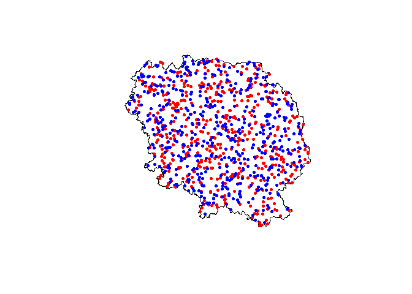
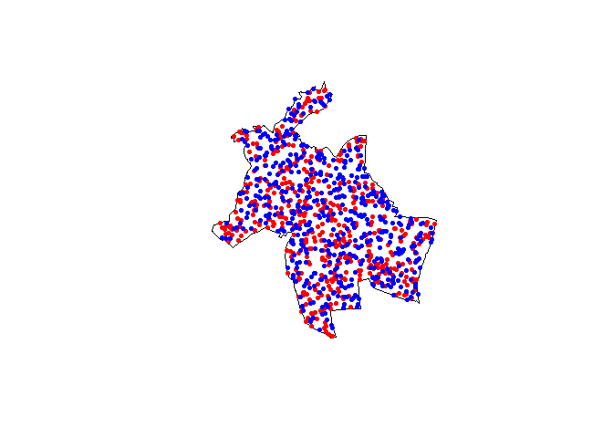

DirectionsAPI
================
Arthur Artaud
3/18/2021

## Librabries

We first install the libraries needed for general operations

``` r
if (!require('tidyr')){
  install.packages('tidyr')
}
```

    ## Loading required package: tidyr

``` r
library('tidyr')
if (!require('sf')){
  install.packages('sf')
}
```

    ## Loading required package: sf

    ## Linking to GEOS 3.9.0, GDAL 3.2.1, PROJ 7.2.1

``` r
library('sf')
```

## Rural points

We make 500 random points of origin and 500 points of destinations
within the shp of the departement of Creuse (a rural zone in France)
that we got from the [ADMIN-EXPRESS-COG édition
2020](https://geoservices.ign.fr/documentation/diffusion/telechargement-donnees-libres.html#admin-express)

``` r
creuse <- st_read("data/Creuse.shp", quiet=TRUE)
plot(st_geometry(creuse))
#creation of points
if (!exists("pt_creuse") & !exists("pt_creuse_b")){
  pt_creuse <- st_sample(x = creuse, size = 500)
  pt_creuse_b <- st_sample(x = creuse, size= 500)
}
#display of the points
plot(st_geometry(pt_creuse), add=T, col="red", pch = 20)
plot(st_geometry(pt_creuse_b), add=T, col="blue", pch = 20)
```

<!-- -->

## Urban points

Same thing for the city of Lyon

``` r
lyon <- st_read("data/Lyon.shp", quiet=TRUE)
plot(st_geometry(lyon))
#creation of points
if (!exists("pt_lyon") & !exists("pt_lyon_b")){
  pt_lyon <- st_sample(x = lyon, size = 500)
  pt_lyon_b <- st_sample(x = lyon, size= 500)
}
#display of the points
plot(st_geometry(pt_lyon), add=T, col="red", pch = 20)
plot(st_geometry(pt_lyon_b), add=T, col="blue", pch = 20)
```

<!-- --> \#\#
Suburban points

For the suburban we took the city of Paris, we did a buffer of 5km to
move away from the very dense close suburb.

Then we did another buffer of 30km and made a rectangle of the southwest
side and took the intersection between this and the buffer minus the
first buffer. Then we did the points.

``` r
paris <- st_read("data/Paris.shp", quiet=TRUE)
#creation of the buffers
paris_b5 <- st_buffer(paris, 5000)
paris_b30_5 <- st_buffer(paris_b5, 30000)
plot(st_geometry(paris_b30_5), lwd = 3, border = "blue")
plot(st_geometry(paris_b5), add = T, lwd=2, border = "red")
plot(st_geometry(paris), add = T)
#creation of the rectangle
m <- rbind(c(652083,6862280), c(696084,6862280), c(696084,6822480), 
           c(652083,6822480), c(652083,6862280))
p <- st_sf(st_sfc(st_polygon(list(m))), crs = st_crs(paris))
plot(p, border="green", lwd=2, add=T)
#intersection
paris_z <- st_intersection(x = p, y = paris_b30_5)
```

    ## Warning: attribute variables are assumed to be spatially constant throughout all
    ## geometries

``` r
paris_f <- st_difference(x = paris_z, y = paris_b5)
```

    ## Warning: attribute variables are assumed to be spatially constant throughout all
    ## geometries

``` r
plot(st_geometry(paris_f), add=T)
#creation of points
if(!exists("pt_paris") & !exists("pt_paris_b")){
  pt_paris <- st_sample(x = paris_f, size = 500)
  pt_paris_b <- st_sample(x = paris_f, size= 500)
}
#display of the points
plot(st_geometry(pt_paris_b), add=T, col="blue", pch = 20)
plot(st_geometry(pt_paris), add=T, col="red", pch = 20)
```

<!-- -->
